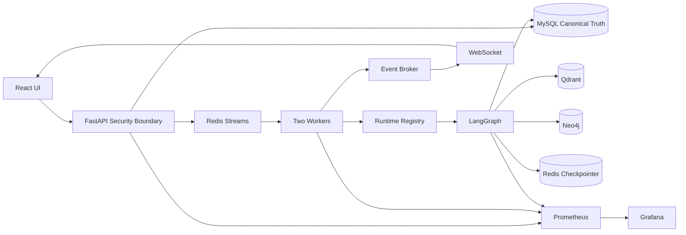

# CountyFlow 最终详细项目报告

> 文档定位：当前项目总说明书。
> 事实基线：[FINAL_FACTS.md](./FINAL_FACTS.md)
> 审计日期：2026-08-31。
> 证据原则：当前代码优先于旧报告；原始 evidence 优先于二次汇总；设计与计划不等于实现。

---

## 1. 执行摘要

CountyFlow 是面向县域物流异常识别与智能调度的工程化 Agent 系统。

系统把用户操作转换为异步任务。

FastAPI 负责安全边界、验证、持久化与发布。

Redis Streams 负责工作队列。

双 Worker 负责消费与恢复。

LangGraph 编排 8 个单一职责 Agent。

MySQL 保存业务 canonical truth。

Qdrant 提供 Vector Memory。

Neo4j 提供 Graph Memory。

Redis checkpointer 保存 GraphState checkpoint body。

MySQL Runtime Registry 保存 canonical checkpoint pointer。

Runtime Override 允许在稳定边界安全人工介入。

Shared Memory Control Plane 治理跨存储事实与投影。

WebSocket 提供 snapshot、history replay 和 live event。

Prometheus 与 Grafana 提供指标、规则、告警和视图。

Security 模块提供 JWT/OIDC、RBAC、限流、审计和脱敏。

React 前端提供六角色白色企业级工作区。

当前工程原型完成度高。

生产 Provider wiring 尚未完成。

灾备 V2-G3 尚未实现。

本轮 Docker daemon 不可用。

因此实时集成、浏览器与性能没有重新执行。

最终判断是：工程化智能调度原型已完成，生产化与灾备未完成。

---

## 2. 审计范围与方法

### 2.1 审计对象

- `backend/` 生产代码、migration 与 tests。
- `frontend/` React 代码、unit tests 与 E2E specs。
- `scripts/` 启动、验收与基准脚本。
- `monitoring/` Prometheus/Grafana 配置。
- `docs/` 设计、计划、runbook 与 verification evidence。
- `benchmarks/` Vector/Graph 数据集。
- `loadtests/` Locust 负载模型。
- `docker-compose.yml`。
- `.env.example` 与 `.docker.env.example`。
- `README`、`Makefile` 与一键启动脚本。
- Alembic migrations。
- Git working tree 状态。

### 2.2 事实优先级

1. 当前生产代码。
2. 当前 test assertions。
3. 当前配置解析结果。
4. 本轮实际命令输出。
5. 原始 verification JSON/CSV/日志。
6. 同批次验收报告。
7. 设计文档与实施计划。

### 2.3 真实性约束

存在设计文档不代表实现。

存在测试文件不代表本轮执行。

存在 compose service 不代表当前容器在线。

存在 Provider class 不代表已接入 graph。

存在历史性能不代表当前实时性能。

存在 checkpoint recovery 不代表 Disaster Recovery。

### 2.4 本轮限制

Git 仓库尚无 commit。

工作树在审计前已有大量变化。

根目录 `.env` 被忽略且含本地配置漂移。

Docker Desktop daemon 未运行。

两个历史 temp 目录 ACL 拒绝读取。

本轮没有修改生产代码或配置。

---

## 3. 当前工程目录

```text
CountyFlow/
├── backend/
│   ├── alembic/
│   │   └── versions/                  # 10 个 migration
│   ├── app/
│   │   ├── acceptance/                # 验收计算与交接逻辑
│   │   ├── agents/                    # 8 个 Agent
│   │   ├── api/v1/                    # REST、WS 与 schema
│   │   ├── audit/                     # 业务审计
│   │   ├── capacity/                  # Capacity Protocol/Service
│   │   ├── core/                      # Settings、DB、errors
│   │   ├── dispatch/                  # 调度写服务
│   │   ├── events/                    # task event broker
│   │   ├── graph/                     # LangGraph builder/state
│   │   ├── graph_memory/              # Neo4j Graph Memory
│   │   ├── idempotency/               # 长期幂等
│   │   ├── locks/                     # Redis execution lock
│   │   ├── memory/                    # Qdrant Vector Memory
│   │   ├── models/                    # SQLAlchemy models
│   │   ├── observability/             # metrics/probes/query
│   │   ├── providers/                 # LLM/Embedding/Environment
│   │   ├── publications/              # dispatch publication
│   │   ├── repositories/              # dispatch repository
│   │   ├── reviews/                   # manual review
│   │   ├── routing/                   # route Protocol/Service
│   │   ├── runtime_overrides/         # intervention protocol
│   │   ├── runtime_threads/           # checkpoint registry
│   │   ├── security/                  # G2 controls
│   │   ├── shared_memory/             # canonical memory control
│   │   ├── streams/                   # Redis Streams adapter
│   │   ├── workers/                   # dispatch worker
│   │   ├── workspace_reads/           # role workspace read models
│   │   ├── main.py                    # FastAPI app
│   │   ├── runtime.py                 # docker-dev runtime wiring
│   │   ├── seed.py                    # development/demo seed
│   │   └── worker_entrypoint.py       # Worker process entry
│   └── tests/                         # 151 个 test files
├── frontend/
│   ├── e2e/                           # 14 个 Playwright specs
│   ├── src/
│   │   ├── app/                       # router/shell
│   │   ├── components/                # common UI
│   │   ├── features/                  # role/business modules
│   │   ├── services/                  # API/WS clients
│   │   └── test/                      # frontend test support
│   ├── package.json
│   └── vite.config.*
├── benchmarks/
│   ├── graph/
│   └── memory/
├── docs/
│   ├── assets/
│   ├── final/                         # 本轮最终文档
│   ├── superpowers/plans/
│   └── verification/                  # 分阶段与原始证据
├── infra/
├── loadtests/
├── monitoring/
│   ├── grafana/
│   └── prometheus/
├── scripts/
├── docker-compose.yml
├── Makefile
├── README.md
├── .env.example
└── .docker.env.example
```

node_modules、Git object、cache、runtime data 和二进制产物未展开。

---

## 4. 业务目标

### 4.1 输入

- 订单身份。
- 异常类型。
- 异常描述。
- 司机身份。
- 车辆身份与状态。
- 路线身份。
- 容量与负载。
- 天气与道路上下文。
- 历史处置经验。
- 人工复核与干预输入。

### 4.2 输出

- 规范化异常上下文。
- 相似经验。
- 已知关系与风险路径。
- 环境评估。
- 运力评估。
- 路线候选与推荐。
- 调度记录。
- 人工复核状态。
- Audit evidence。
- Runtime Thread terminal state。
- 前端可读状态和实时事件。

### 4.3 非目标

当前不是通用聊天机器人。

当前不是自动驾驶系统。

当前不是物流 ERP 的完整替代。

当前不是 Kafka 事件平台。

当前不是已完成灾备的生产部署。

当前 graph 不是 LLM 驱动决策。

---

## 5. 总体架构



### 5.1 同步面

Authentication。

Authorization。

Rate Limit。

Task Creation。

Status/Result Query。

Manual Review。

Runtime Override API。

Memory Mutation API。

Workspace Read API。

### 5.2 异步面

Redis Stream delivery。

Worker execution。

LangGraph nodes。

Checkpoint promotion。

Task events。

Projection reconciliation。

Runtime override reconciliation。

### 5.3 真相面

MySQL 是业务 canonical truth。

Runtime pointer 在 MySQL。

Checkpoint body 在 Redis。

Qdrant 是语义投影。

Neo4j 是关系投影。

Prometheus 是 telemetry，不是业务 truth。

Frontend local state 不是业务 truth。

---

## 6. API 层

### 6.1 Auth API

- 获取 demo employees。
- 创建 demo session。
- 创建 development session。
- 获取 current principal。
- logout 并撤销 token。

### 6.2 Workspace API

- Admin/workspace overview。
- Orders 分页读取。
- Anomalies 分页读取。
- Reviews 读取。
- My Tasks 读取。
- Runtime Threads 读取。
- Memory Records 读取。

### 6.3 Dispatch API

- 创建 dispatch task。
- 查询 task status。
- 查询 task result。
- 发布 dispatch result。

### 6.4 Review API

- 获取待复核项。
- 提交 review decision。
- 记录 reviewer 与结果。

### 6.5 Runtime API

- 按 task 查 thread。
- 获取 thread detail。
- 获取 thread history。
- 提交 runtime override。
- 获取 intervention detail/history。

### 6.6 Memory API

- 创建 memory mutation。
- 查询 mutation。
- 查询 canonical fact。

### 6.7 Observability API

- summary。
- agents。
- workers。
- memory。
- runtime。
- dependencies。

### 6.8 Security/Realtime API

- 查询 security audit。
- 申请 WS ticket。
- 连接 task event WebSocket。
- health check。

---

## 7. Authentication 与 Authorization

### 7.1 AuthenticationProvider

AuthenticationProvider 隔离 token 解析与业务 endpoint。

Development provider 使用 HS256。

Secret 最短 32 字符。

Production boundary 使用 OIDC JWT。

允许算法为 RS256/ES256。

JWKS 具有 resolver、cache 和 timeout。

校验 issuer。

校验 audience。

校验 issued-at。

校验 not-before。

校验 expiry。

校验 JWT ID。

Redis 保存 revoked jti。

### 7.2 AuthenticatedPrincipal

- subject。
- display name。
- roles。
- permissions。
- auth method。
- issued at。
- expires at。
- jti。

### 7.3 实际六角色

EMPLOYEE 负责本人配送任务读取。

DISPATCHER 负责调度创建和业务读取。

SUPERVISOR 负责人工复核、记忆写与 Runtime Override。

OPERATOR 负责运行、Agent 与监控。

AUDITOR 负责审计与受控只读。

ADMIN 具备全部权限。

### 7.4 Permission

- `dispatch:read`。
- `dispatch:create`。
- `dispatch:review`。
- `orders:read`。
- `anomalies:read`。
- `agents:read`。
- `memory:read`。
- `memory:mutate`。
- `runtime:read`。
- `runtime:override`。
- `audit:read`。
- `monitor:read`。
- `system:admin`。

### 7.5 Rate Limit

主体维度是 principal subject。

操作维度是 operation class。

后端是 Redis token bucket。

submit 默认 30 capacity / 120 min refill window。

override 默认 3 / 12 min。

memory mutation 默认 5 / 30 min。

observability 默认 60 / 300 min。

WS ticket 默认 10 / 60 min。

invalid auth 默认 10 / 60 min。

高风险写 fail closed。

低风险读可用受限 emergency limiter。

---

## 8. Task Creation 与队列发布

### 8.1 请求顺序

1. 解析 body。
2. 验证 body size。
3. 验证 token。
4. 构造 principal。
5. 验证 `dispatch:create`。
6. 消耗 submit bucket。
7. 规范化 idempotency key。
8. 在 MySQL 创建或解析 task。
9. 向 Redis Stream XADD。
10. 返回 task id 与 HTTP 202。

### 8.2 重要不变量

API 不同步执行 LangGraph。

task id 必须稳定。

idempotency key 必须稳定。

Redis 不保存长期唯一业务真相。

发布失败不能伪装为已排队。

错误不能包含 credential。

---

## 9. Redis Streams

### 9.1 Stream

Stream 保存任务 delivery record。

消息包含 task identity。

消息包含 idempotency identity。

Stream id 用于 delivery sequencing。

### 9.2 Consumer Group

两个 Worker 共享 consumer group。

新消息通过 `XREADGROUP` 读取。

正在处理的消息进入 PEL。

处理完成后 `XACK`。

### 9.3 ACK 规则

Graph 完成不是唯一条件。

Dispatch 必须耐久化。

Audit 必须耐久化。

Runtime terminal 必须耐久化。

Idempotency terminal 必须可重放。

上述条件满足后才能 ACK。

### 9.4 Pending Recovery

Worker 崩溃后消息留在 pending。

消息达到 min idle。

存活 Worker 调用 XAUTOCLAIM。

存活 Worker 读取 Runtime Thread。

存活 Worker从 checkpoint 恢复。

### 9.5 Retry 与 DLQ

默认最多 3 次 delivery attempt。

指数退避从约 1 秒开始。

退避最大约 30 秒。

可重试错误回 pending。

耗尽后写 DLQ。

DLQ 写成功后 ACK 原消息。

### 9.6 Effectively Once

Redis lock 防并行执行。

MySQL ledger 防长期重复副作用。

terminal replay 防重复 dispatch。

optimistic lock 防 silent overwrite。

这不是 exactly-once delivery。

---

## 10. LangGraph 与 GraphState

### 10.1 图顺序

`intake`

↓

`entity_memory`

↓

`graph_memory`

↓

`environment`

↓

`capacity`

↓

`routing`

↓

`dispatch`

↓

`audit`

### 10.2 GraphState 类别

Task identity。

Order identity。

Anomaly input。

Normalized description。

Driver/vehicle/route identity。

Vehicle status。

Vector memory matches。

Graph facts and paths。

Environment result。

Capacity result。

Route candidates。

Recommendation。

Dispatch result。

Manual review flag/reason。

Errors。

Node trace。

Started/completed timestamps。

Checkpoint context。

### 10.3 Vehicle Status

NORMAL。

BROKEN。

UNAVAILABLE。

MAINTENANCE。

---

## 11. Agent 1：Intake

### 输入

task id。

order id。

anomaly type。

description。

driver/vehicle/route context。

### 行为

校验 task 与 order。

校验 anomaly 与 description。

规范化字符串。

初始化 started_at。

初始化节点 trace。

### 输出

规范化 GraphState patch。

人工复核标记。

输入错误证据。

### 失败策略

缺失关键字段不猜测。

设置 manual review。

保留可审计原因。

### 图位置

第 1/8。

---

## 12. Agent 2：Entity Memory

### 输入

规范化异常文本。

driver id。

route id。

anomaly type。

### 数据源

EmbeddingProvider。

Qdrant repository。

### 行为

构建 query text。

请求 embedding。

查询 Cosine similarity。

过滤 ACTIVE projection。

过滤未过期记录。

返回 top 3。

### 输出

memory matches。

score。

resolution text。

metadata/provenance。

### 降级

ProviderError 转 `MEMORY_RECALL_ERROR`。

返回空 matches。

允许下游继续。

### 图位置

第 2/8。

---

## 13. Agent 3：Graph Memory

### 输入

订单、司机、车辆、路线、环境和异常上下文。

### 数据源

Deterministic extractor。

Neo4j repository。

### 行为

抽取实体。

抽取关系。

upsert entity。

upsert relation。

查询 related facts。

查询 multi-hop paths。

### 边界

hop 1–3。

默认 hop 2。

limit 25。

timeout 1 second。

### 输出

graph facts。

known paths。

relation evidence。

### 降级

Neo4j failure 返回空 facts/paths。

记录错误与 dependency metric。

主流程继续。

### 图位置

第 3/8。

---

## 14. Agent 4：Environment

### 输入

route 与 anomaly context。

### 数据源

HttpEnvironmentProvider。

StaticRouteFallbackProvider。

CircuitBreaker。

### 行为

异步请求天气/道路。

使用显式 timeout。

解析规范化 EnvironmentResult。

### 降级

连续失败打开 circuit breaker。

返回静态路线 fallback。

不泄漏 authorization header。

### 图位置

第 4/8。

### 特殊意义

其结束边界是 Runtime Override 合法起点。

---

## 15. Agent 5：Capacity

### 输入

driver id。

vehicle id。

route id。

order id。

vehicle status。

### 数据源

CapacityProvider Protocol。

当前 runtime 为 InMemoryCapacityProvider。

### 行为

读取 vehicle/driver availability。

读取 load ratio。

比较 limited threshold。

比较 unavailable threshold。

### Override 响应

BROKEN 强制 vehicle unavailable。

UNAVAILABLE 强制 vehicle unavailable。

MAINTENANCE 强制 vehicle unavailable。

### 失败

Provider error 转 CapacityEvaluationError。

进入人工复核或标记容量状态不可判定。

### 图位置

第 5/8。

---

## 16. Agent 6：Routing

### 输入

Environment result。

Capacity result。

Vector memory。

Graph facts/paths。

### 数据源

RouteProvider Protocol。

当前 runtime 为 InMemoryRouteProvider。

### 行为

生成候选路线。

过滤不安全候选。

结合历史 resolution。

使用 memory adoption threshold。

形成 recommendation。

### 输出

route candidates。

recommended route。

memory adoption flag。

decision explanation。

### 降级

无安全候选则 manual review。

低置信记忆不自动采纳。

### 图位置

第 6/8。

---

## 17. Agent 7：Dispatch

### 输入

route decision。

task/order identity。

manual review state。

### 数据源

DispatchService。

SQLAlchemy repository。

MySQL dispatch row。

### 行为

创建或更新 dispatch。

保存 route 与 decision。

维护 version column。

### 并发

使用 `version_id_col`。

捕获 `StaleDataError`。

转换为并发冲突。

不做 Python equality lock。

### 输出

dispatch id/status/result。

### 图位置

第 7/8。

---

## 18. Agent 8：Audit

### 输入

完整节点 trace。

记忆 evidence。

环境/容量/路线 decision。

人工复核状态。

dispatch result。

errors。

### 行为

构建 audit record。

持久化 MySQL。

记录完成时间。

### 可靠性

Audit failure 不是可忽略日志失败。

Audit 未持久化时不能安全 terminal ACK。

### 图位置

第 8/8。

---

## 19. LLM 与 Provider 真实边界

### 19.1 LLMProvider

Protocol 存在。

OpenAI-Compatible implementation 存在。

Fake test implementation 存在。

显式 async timeout 存在。

Settings 中有 provider/base_url/key/model。

GraphDependencies 没有 LLM 字段。

8 个 Agent 没有调用 LLMProvider。

当前不能称为 LLM-driven graph。

### 19.2 EmbeddingProvider

Protocol 存在。

OpenAI-Compatible implementation 存在。

Fake deterministic implementation 存在。

docker compose 配置 fake。

runtime.py 实例化 FakeEmbeddingProvider。

配置 dimension 为 128。

真实 benchmark 使用 dimension 2560。

两者属于不同运行边界。

### 19.3 Production Profile

production runtime 会主动抛错。

错误说明 real-provider wiring 未实现。

这是安全 fail-fast。

它同时证明生产 runtime 未完成。

---

## 20. Qdrant Vector Memory

### 20.1 Collection

运行集合：`entity_resolution_memory`。

基准集合：`entity_resolution_memory_benchmark`。

距离：Cosine。

运行维度：配置 128。

真实历史维度：2560。

### 20.2 Point ID

使用 UUID5。

命名输入是 `countyflow-memory:{memory_id}`。

相同 memory id 得到稳定 point id。

### 20.3 Payload

memory_id。

driver_id。

route_id。

anomaly_type。

resolution_text。

metadata。

created_at。

可选 data_provenance。

projection_status。

expires_at。

### 20.4 Query

构建文本。

生成 query embedding。

验证 dimension。

调用 query_points。

应用 ACTIVE/legacy filter。

应用 expires_at filter。

按 score 排序。

返回 top_k。

### 20.5 Write

验证 record。

生成 embedding。

确保 collection/schema。

生成稳定 point id。

写 vector 与 payload。

Shared Memory 路径先写 STAGED。

finalization 后改 ACTIVE。

### 20.6 Benchmark

日期 2026-08-27。

OpenAI-Compatible host 为 `api.siliconflow.cn`。

模型 `Qwen/Qwen3-Embedding-4B`。

维度 2560。

记忆 10 条。

查询 50 条。

Top-1 49/50。

Top-1 98%。

Top-3 50/50。

Top-3 100%。

失败 query 45。

合法 adoption 4/4。

非法 adoption 0/3。

本轮未重跑。

---

## 21. Neo4j Graph Memory

### 21.1 Version

Docker image 5.26-community。

Python driver 6.2.0。

### 21.2 Entity Types

Driver。

Vehicle。

Route。

Weather。

RoadCondition。

Station。

Anomaly。

Resolution。

DispatchOrder。

PolicyRule。

UserPreference。

### 21.3 Relation Types

DRIVES。

SERVES。

HAS_RISK_ON。

AFFECTED_BY。

HIGH_RISK_WHEN。

ALTERNATIVE_TO。

RESOLVED_BY。

CONFLICTS_WITH。

DEPENDS_ON。

STATUS。

### 21.4 Schema

GraphEntity.entity_key 唯一约束。

entity_id 索引。

entity_type 索引。

### 21.5 Repository

参数化 Cypher。

实体 upsert。

关系 upsert。

related fact 查询。

multi-hop path 查询。

projection status filter。

expiry filter。

bounded limit。

explicit timeout。

### 21.6 Known Path

Known Path 是已落库关系路径。

它不是 LLM 生成的解释。

它具有实体和边证据。

跳数被限制避免无界遍历。

### 21.7 Benchmark

数据集覆盖 8 个 entity type。

数据集覆盖 6 个 relation type。

代码 schema 上限为 11/10。

fact recall 20/20。

path recall 20/20。

warm samples 50。

平均 7.808 ms。

P95 10.354 ms。

最大 12.632 ms。

本轮未重跑。

### 21.8 为什么 Vector 不能替代 Graph

相似度不是关系事实。

相似文本可能属于不同司机。

相似路线不等于明确替代路线。

Vector 不天然表达方向边。

Vector 不天然表达多跳约束。

Graph 可以给出 path evidence。

Vector 适合开放召回。

Graph 适合已知关系。

---

## 22. Shared Memory Control Plane

### 22.1 数据模型

Canonical Fact。

Evidence。

Mutation。

Mutation Attempt。

Decision。

Version。

Projection identity/status。

Idempotency identity。

### 22.2 Decision

CREATE：新建事实。

MERGE：合并相容证据。

REPLACE：新版本替代旧事实。

REJECT：拒绝低质量/不合法事实。

CONFLICT_REVIEW：冲突需要人工处理。

NOOP：内容不产生有效变化。

### 22.3 Fact Status

ACTIVE。

EXPIRED。

PENDING_REVIEW。

CONFLICT。

### 22.4 Mutation Status

PENDING。

APPLYING。

FINALIZING。

APPLIED。

PARTIAL。

REJECTED。

CONFLICT。

FAILED。

### 22.5 Projection Status

NOT_REQUIRED。

PENDING。

STAGED。

ACTIVE。

RETIRED。

FAILED。

### 22.6 精确生命周期

Mutation 进入 APPLYING。

Qdrant projection 进入 STAGED。

Neo4j projection 进入 STAGED。

Mutation 进入 FINALIZING。

Canonical Fact 成为 ACTIVE。

新 projections 成为 ACTIVE。

旧 projections 成为 RETIRED。

Mutation 成为 APPLIED。

FINALIZING 不是 projection status。

### 22.7 并发

获取 Redis fact lock。

验证 expected version。

使用 SQLAlchemy version_id_col。

持久化 idempotency key。

记录每个 attempt。

stale write 进入冲突。

### 22.8 Partial Recovery

跨存储步骤可部分成功。

PARTIAL 是 durable 状态。

attempt 记录已完成步骤。

reconciler 幂等继续。

读取侧只读 ACTIVE。

STAGED 不可泄漏。

### 22.9 历史验证

决策矩阵覆盖 6 类决策。

Qdrant failure 可恢复。

Neo4j failure 可恢复。

PARTIAL → APPLIED。

Qdrant staged leak 0。

Neo4j staged leak 0。

20 轮 lost update 0。

---

## 23. Runtime Thread

### 23.1 为什么普通 LangGraph 不够

Checkpoint body 不等于 current pointer。

Thread id 不等于 task id。

图内部状态不等于业务 terminal state。

人工干预需要 state version。

跨进程恢复需要 durable registry。

审计需要 append-only boundary events。

### 23.2 MySQL Runtime Registry

保存 task-thread mapping。

保存 runtime status。

保存 state version。

保存 current checkpoint id。

保存 checkpoint namespace。

保存 next node。

保存 terminal metadata。

使用 version_id_col。

### 23.3 Redis Checkpointer

使用 AsyncRedisSaver。

保存完整 GraphState checkpoint。

namespace 为 `countyflow`。

默认 TTL 10080 分钟。

最大 payload 1 MiB。

### 23.4 Node Promotion

Graph 以 sync durability stream。

节点完成生成 child checkpoint。

Runner 读取 child metadata。

验证 parent ancestry。

验证 expected current checkpoint。

验证 expected state version。

验证 expected next node。

MySQL CAS 提升 pointer。

追加 runtime event。

### 23.5 N+1 Resume

加载 current pointer。

读取 exact checkpoint body。

验证 checkpoint 可用。

读取 next node。

从 next node 执行。

已完成 N 不再重复。

### 23.6 历史验证

5/5 recovery success。

intake 后恢复 entity_memory。

checkpoint evidence max 4.579 s。

worker recovery min 4.678 s。

worker recovery avg 4.770 s。

worker recovery max/P95 4.824 s。

---

## 24. Runtime Override

### 24.1 业务场景

Environment 已经执行完成。

车辆最初为 NORMAL。

现场人员发现车辆故障。

Capacity 尚未执行。

Supervisor 需要让后续图读取 BROKEN。

### 24.2 合法修改

目标类型只允许 Vehicle。

字段只允许 status。

初始状态只允许 NORMAL。

目标状态允许 BROKEN。

目标状态允许 UNAVAILABLE。

目标状态允许 MAINTENANCE。

稳定边界只允许 environment → capacity。

### 24.3 权限链路

Frontend 显示 eligible control。

API 验证 principal。

API 要求 `runtime:override`。

消耗 override rate bucket。

写 Security Audit。

### 24.4 一致性链路

获取 per-thread Redis lock。

解析 idempotency record。

验证 expected version。

验证 expected next node。

MySQL CAS claim OVERRIDING。

读取 exact canonical checkpoint。

调用 `aupdate_state`。

使用 `as_node="environment"`。

只 patch vehicle_status。

获得 child checkpoint。

验证 child parent。

验证 ancestry。

验证非目标字段未变化。

MySQL atomic pointer promotion。

追加 intervention event。

完成 idempotency record。

释放 lock。

### 24.5 为什么不能直接 UPDATE DB

Graph 下游读取 checkpoint state。

旁路 DB 字段不会自动进入 checkpoint。

DB 与 Redis state 会分叉。

Audit 不知道状态来源。

Worker 可能同时推进节点。

直接更新无法证明修改边界。

child checkpoint 才是合法图状态版本。

### 24.6 Crash Recovery

跨存储步骤可能中断。

Attempt 保存阶段证据。

PARTIAL 可被 reconciler 读取。

Reconciler 对比 pointer/child/idempotency。

幂等完成或明确冲突。

### 24.7 历史结果

合法 override 50/50。

stale blocked 20/20。

silent overwrite 0。

并发 20 轮唯一 winner。

并发 violation 0。

boundary race 50 轮 violation 0。

Capacity reads BROKEN 50/50。

P95 181.643 ms。

---

## 25. 并发一致性矩阵

| 场景 | 第一层 | 最终屏障 | 持久证据 | 结果语义 |
|---|---|---|---|---|
| 双 Worker 同任务 | Redis execution lock | MySQL idempotency | task ledger | replay/one effect |
| Dispatch 并发 | service boundary | version_id_col | dispatch version | 409/conflict |
| Shared Fact 并发 | Redis fact lock | expected version/version_id_col | mutation attempt | conflict review |
| Override 并发 | Redis thread lock | Runtime CAS | override attempt | one winner |
| Worker vs Override | boundary lock | pointer/version CAS | runtime event | worker or override wins |
| 重复 HTTP | idempotency key | unique ledger | task record | same task id |
| 重复 Stream delivery | execution lock | terminal ledger | audit/dispatch | no duplicate effect |

Redis lock 不是唯一正确性机制。

锁有 TTL。

进程可能暂停。

网络可能分区。

数据库版本/CAS 是最终并发判定。

---

## 26. WebSocket

### 26.1 Ticket Creation

前端调用受保护 REST endpoint。

后端验证 `dispatch:read`。

后端验证 task scope。

后端生成随机 ticket。

Redis 只保存 digest。

TTL 45 秒。

### 26.2 Connection

前端携带 opaque ticket。

WebSocket 使用 GETDEL。

ticket 单次消费。

验证 exact task scope。

验证 permission snapshot。

### 26.3 Close Semantics

missing ticket：4401。

wrong scope：4403。

replay/expired：4408。

security control unavailable：1011。

### 26.4 Event Delivery

先发送 current task snapshot。

按 last_event_id replay history。

再订阅 live event。

断线后可重新申请 ticket。

状态 API 提供最终 fallback。

---

## 27. MySQL 持久化

### 27.1 业务表

orders。

anomalies。

dispatches。

audit_records。

dispatch_tasks。

dispatch_publications。

### 27.2 Runtime 表

runtime_threads。

runtime_thread_events。

runtime_overrides。

runtime_override_attempts。

### 27.3 Memory 表

memory_mutations。

memory_facts。

memory_evidence。

memory_mutation_attempts。

### 27.4 Security/Product 表

security_audit_events。

demo_employee_accounts。

### 27.5 Alembic

共 10 个 revision。

最新 revision 是 `20260830_10_delivery_employee_role.py`。

Migration service 先 upgrade head。

之后 development seed。

Migration 是一次性 compose service。

### 27.6 精度与并发

距离/成本等值使用 Decimal。

Dispatch 使用 version_id_col。

RuntimeThread 使用 version_id_col。

MemoryFact 使用 version_id_col。

StaleDataError 转明确冲突。

---

## 28. Frontend 路由与页面

### 28.1 `/workspace`

主要用户：Dispatcher。

用途：调度工作台。

数据：真实 task buckets。

交互：创建、查看、进入详情。

权限：dispatch read/create。

状态：LIVE/EMPTY/UNAVAILABLE。

### 28.2 `/supervisor`

主要用户：Supervisor。

用途：review 与 runtime 摘要。

数据：真实 reviews/runtime read models。

交互：进入复核与干预。

全局 intervention history 未暴露。

### 28.3 `/operations`

主要用户：Operator。

用途：运行与依赖态势。

数据：observability/runtime summary。

权限：agents/runtime/monitor read。

### 28.4 `/audit`

主要用户：Auditor。

用途：安全审计。

数据：security audit API。

全局业务、Memory、Override 历史未全部暴露。

### 28.5 `/overview`

主要用户：Admin。

用途：全局统计。

数据：真实 workspace overview。

禁止 mock KPI fallback。

### 28.6 `/my-tasks`

主要用户：EMPLOYEE。

用途：本人配送任务。

数据：employee-assigned tasks。

权限：dispatch read。

### 28.7 `/team-tasks`

当前状态：NOT_EXPOSED。

路由存在。

产品数据未开放。

不能称为已交付团队任务页。

### 28.8 `/reviews`

主要用户：Supervisor。

用途：人工复核队列。

数据：真实 review API。

交互：提交 decision。

### 28.9 `/runtime`

主要用户：Supervisor/Operator/Auditor/Admin。

用途：Runtime Thread 列表/详情/历史。

数据：安全 metadata。

不暴露 checkpoint body。

可在合法边界触发 override。

### 28.10 `/dispatch`

主要用户：Dispatcher/Admin。

用途：任务列表与创建。

数据：真实 dispatch API。

工作区级 AI recommendation 聚合未暴露。

### 28.11 `/dispatch/:taskId`

用途：任务详情与 Agent playback。

数据：snapshot、history、WebSocket live event。

交互：跟踪状态和结果。

### 28.12 `/anomalies`

用途：异常分页读取。

数据：MySQL read model。

状态：EMPTY/UNAVAILABLE/NO_PERMISSION。

### 28.13 `/orders`

用途：订单分页读取。

数据：MySQL read model。

状态：EMPTY/UNAVAILABLE/NO_PERMISSION。

### 28.14 `/agents`

用途：Agent 运行状态与指标。

用户：Dispatcher/Operator/Admin 等有权限角色。

数据：observability agents API。

### 28.15 `/memory`

用途：Vector/Shared Memory 可用 read model。

数据：Qdrant records + control-plane views。

写操作需要 `memory:mutate`。

### 28.16 `/monitor`

用途：系统运行与依赖监控。

数据：observability APIs。

权限：monitor read。

---

## 29. Frontend 视觉设计

当前最终主题是 White/Light Enterprise Theme。

Main background 为白色/浅中性色。

Sidebar 为白色。

Topbar 为白色。

Teal 是主要 accent。

Cards 使用轻边框与层次。

Tables 保持高信息密度与可扫描性。

Graph 节点有明确状态。

Monitoring 用一致颜色表达健康度。

Dialogs 用于高风险确认。

Typography 使用企业级清晰层级。

Responsive breakpoint 包含 600px 等布局。

Focus-visible 支持键盘操作。

Reduced-motion 避免强制动画。

Dialog、tab、table、graph node 具有可访问语义。

早期 dark rules 仍在文件前部。

后续 final overrides 完整覆盖。

历史 computed browser evidence 为白色。

不能把旧 dark design 写成当前 UI。

---

## 30. Data Truth

### LIVE

当前真实 API 返回。

### DEMO

明确标记的开发种子数据。

### VERIFIED

有验收 evidence 的基线。

### STALE

最后已知值，不代表当前在线值。

### NOT_EXPOSED

产品/API 未开放该数据。

### UNAVAILABLE

依赖或 API 当前不可用。

### NO_PERMISSION

当前 principal 没有权限。

### EMPTY

真实查询成功但结果为空。

### 原则

API mode 禁止 silent mock fallback。

错误不能被伪装成空数据。

空数据不能被伪装成未授权。

演示数据不能冒充 live KPI。

页面不同区域必须共享同一 truth context。

---

## 31. Observability

### 31.1 组件

MetricsRecorder。

Prometheus exporter/server。

Dependency probes。

Correlation context。

Structured logging。

Query catalog/service。

Prometheus server。

Grafana provisioning。

### 31.2 Metric Family 数量

当前 `MetricDefinition` family 为 46。

旧文档 42 已过期。

### 31.3 Metric 类别

HTTP request/latency/error。

Authentication result。

Authorization denial。

Rate limit result。

WS ticket rejection。

WebSocket connection/event。

Agent duration/outcome。

Environment fallback/breaker。

Vector query/embedding。

Graph query/failure。

Shared Memory mutation/projection。

Checkpoint write/read/size。

Runtime Thread state。

Runtime Override result/conflict。

Worker processing/recovery/retry。

Redis pending/lag/DLQ。

Dependency availability/latency。

Invariant violation。

### 31.4 Cardinality

Route 使用模板。

Status 使用 class/outcome。

Agent 使用固定 name。

Dependency 使用固定 name。

不把 task id 放 label。

不把 user id 放 label。

不把 raw error 放 label。

Correlation ID 放日志与 audit。

---

## 32. Recording Rules

1. http_qps。
2. http_p95。
3. http_error_ratio。
4. agent_p95。
5. graph_p95。
6. checkpoint_p95。
7. override_success_ratio。
8. worker_pending。
9. stream_lag。

Recording rules 降低 dashboard/alert 重复表达式复杂度。

---

## 33. Alert Rules

1. CountyFlowBackendDown。
2. CountyFlowWorkerDown。
3. CountyFlowDependencyDown。
4. CountyFlowApiLatencyHigh。
5. CountyFlowApiErrorRateHigh。
6. CountyFlowGraphLatencyHigh。
7. CountyFlowWorkerRecoverySloBreach。
8. CountyFlowInvariantViolation。
9. CountyFlowWorkerPendingBacklog。
10. CountyFlowWorkerStreamLagHigh。
11. CountyFlowCheckpointLatencyHigh。
12. CountyFlowMemoryPartialStuck。
13. CountyFlowOverrideConflictSpike。
14. AuthenticationFailureSpike。
15. AuthorizationDeniedSpike。
16. RuntimeOverrideDeniedSpike。
17. RateLimitSpike。
18. WsTicketRejectionSpike。

旧报告 13 alerts 已过期。

### Alert 生命周期

Normal：表达式未满足。

Pending：表达式满足但未超过 `for`。

Firing：持续超过 `for`。

Resolved：表达式恢复正常。

Neo4j 历史故障注入验证了 pending → firing → resolved。

---

## 34. SLO

### API Latency

rolling 5 minutes。

至少 100 requests。

P95 < 300 ms。

### API Error

rolling 5 minutes。

至少 100 requests。

5xx ratio < 0.1%。

### Graph Query

至少 20 queries。

P95 < 150 ms。

### Worker Recovery

Recovery ≤ 5 s。

### Consistency

Projection leak = 0。

Downstream stale read = 0。

### Guardrails

Checkpoint latency 等存在门槛。

不是所有 threshold 都应称为 SLO。

Live metric 与 acceptance baseline 必须分开。

---

## 35. Failure Isolation

### Neo4j Down

Graph Memory 安全降级为空。

业务继续使用其他证据。

dependency metric 变更。

alert pending/firing/resolved。

历史已验证。

### Qdrant/Embedding Down

Entity Memory 返回空 recall。

记录 MEMORY_RECALL_ERROR。

Shared Memory projection 可进入 PARTIAL。

读取侧不读 STAGED。

### Environment API Timeout

显式 async timeout。

Circuit breaker。

Static route fallback。

规范化 Provider error。

### Worker Down

未 ACK 消息保留 pending。

另一个 Worker XAUTOCLAIM。

Runtime checkpoint N+1 resume。

历史 recovery ≤ 4.824 s。

### Redis Queue Failure

任务发布不能伪装成功。

pending 可在恢复后 reclaim。

AOF marker 历史验证保留。

### Redis Security Control Failure

高风险写 fail closed。

WS security failure 使用 1011。

低风险读仅受限 emergency path。

### Prometheus Down

业务 API/Worker 不依赖 Prometheus 成功。

观测能力下降。

历史故障隔离已验证。

### Grafana Down

Dashboard 不可用。

Prometheus 和业务可继续。

历史故障隔离已验证。

### MySQL Conflict

StaleDataError 转 conflict。

不 silent overwrite。

### MySQL Down

关键写无法安全成功。

不能降级为 Redis-only canonical truth。

---

## 36. Docker Topology

### 36.1 Services

mysql：canonical relational store。

neo4j：Graph Memory projection/query。

qdrant：Vector Memory projection/query。

redis：Streams、checkpoint、lock、ticket、revocation、rate limit。

migration：Alembic upgrade + development seed。

worker-1：dispatch consumer。

worker-2：dispatch consumer/recovery peer。

backend：FastAPI API/WS。

frontend：React static/app server。

prometheus：metrics scrape/rules/alerts。

grafana：dashboard visualization。

### 36.2 Counts

Declared services：11。

One-shot services：1。

Long-running services：10。

Named volumes：6。

Networks：2。

### 36.3 Volumes

MySQL data。

Redis data。

Qdrant data。

Neo4j data。

Prometheus data。

Grafana data。

### 36.4 Networks

default。

host_access。

### 36.5 Healthchecks

backend 有 healthcheck。

mysql 有 healthcheck。

neo4j 有 healthcheck。

qdrant 有 healthcheck。

redis 有 healthcheck。

prometheus 有 healthcheck。

grafana 有 healthcheck。

frontend 无 healthcheck。

migration 无 healthcheck。

worker-1 无 healthcheck。

worker-2 无 healthcheck。

### 36.6 Runtime Profile

Compose 是 docker-dev。

Embedding 是 fake。

Embedding model 是 development-deterministic-128。

Capacity 是 in-memory。

Routing 是 in-memory。

### 36.7 本轮验证

`docker compose --env-file .docker.env config --services` 成功。

`docker compose ps` 因 daemon 未运行失败。

Declared topology VERIFIED。

Live health NOT VERIFIED。

---

## 37. 启动模式

### Light Launcher

SQLite。

Backend。

Frontend。

无 Redis Streams。

无 Worker。

不代表完整异步拓扑。

### Full Launcher

Docker Compose。

11 declared services。

真实 MySQL/Redis/Qdrant/Neo4j。

Prometheus/Grafana。

双 Worker。

代表开发验收拓扑。

仍不是生产 Provider 拓扑。

---

## 38. 技术栈与版本

### Backend

Python 3.12.7。

项目要求 Python ≥3.12。

FastAPI 0.141.1。

LangGraph 1.2.11。

langgraph-checkpoint-redis 0.5.2。

SQLAlchemy 2.0.52。

Alembic 1.19.1。

redis-py 6.4.0。

qdrant-client 1.19.0。

neo4j driver 6.2.0。

prometheus-client 0.26.0。

PyJWT 2.13.0。

httpx 0.28.1。

### Frontend

Node 24.18.0。

npm 11.16.0。

React 19.2.8。

ReactDOM 19.2.8。

React Router DOM 7.18.2。

Vite 8.2.2。

TypeScript 6.0.3。

Vitest 4.1.11。

ESLint 10.8.1。

Playwright 1.62.1。

lucide-react 1.33.0。

### Infrastructure

MySQL 8.4。

Redis 8.2.9-alpine。

Neo4j 5.26-community。

Prometheus 3.5.0。

Grafana 12.1.0。

Qdrant 使用 compose/build 配置。

Docker Compose。

---

## 39. 测试体系

### Backend Unit/Behavior

151 个 test files。

覆盖 Agent。

覆盖 API。

覆盖 Worker。

覆盖 Streams。

覆盖 Runtime Thread。

覆盖 Runtime Override。

覆盖 Shared Memory。

覆盖 Security。

覆盖 Observability。

覆盖 workspace read models。

### 本轮 Backend 结果

Ruff PASS。

两个 ACL directory warnings。

默认 pytest collection 15 errors。

根因是 ignored `.env` dev JWT secret 过短。

未打印 secret。

进程级 auth disabled 后执行成功。

833 passed。

7 skipped。

703 warnings。

224.87 seconds。

### 7 个 Skip

真实 Redis checkpoint：2。

真实 security MySQL：1。

真实 security Redis：3。

真实 shared-memory race：1。

Docker daemon 不可用所以未补跑。

### Frontend Unit

Vitest 49 files。

228 tests passed。

### Frontend Lint

ESLint exit 0。

0 errors。

2 Fast Refresh warnings。

### Frontend Build

Vite build PASS。

1915 modules transformed。

CSS 69.90 kB。

CSS gzip 13.98 kB。

Main JS 489.81 kB。

Main JS gzip 143.96 kB。

### Browser E2E

14 Playwright specs。

本轮未运行。

历史 role light UI 1/1。

历史 security roles 6/6。

历史 authenticated business regression 7/7。

历史 manual review 1/1。

### Docker E2E

本轮未运行。

历史 V2-E 有原始证据。

### DR E2E

不存在。

---

## 40. Final Verified Metrics

| Metric | Value | Evidence Date/Stage | Current Audit Meaning |
|---|---:|---|---|
| Vector Top-1 | 49/50 = 98% | 2026-08-27 real embedding | NOT RE-VERIFIED |
| Vector Top-3 | 50/50 = 100% | 2026-08-27 real embedding | NOT RE-VERIFIED |
| Graph fact recall | 20/20 | V2-E | NOT RE-VERIFIED |
| Graph path recall | 20/20 | V2-E | NOT RE-VERIFIED |
| Graph warm P95 | 10.354 ms | V2-E, 50 samples | NOT RE-VERIFIED |
| 15-round black box | 15/15 | V2-E | NOT RE-VERIFIED |
| Runtime legal override | 50/50 | V2-E race evidence | NOT RE-VERIFIED |
| Stale override | blocked 20/20 | V2-E race evidence | NOT RE-VERIFIED |
| Silent stale overwrite | 0 | V2-E race evidence | NOT RE-VERIFIED |
| Boundary race violation | 0/50 | V2-E race evidence | NOT RE-VERIFIED |
| Capacity read BROKEN | 50/50 | V2-E override evidence | NOT RE-VERIFIED |
| Shared Memory lost update | 0/20 | V2-E concurrency | NOT RE-VERIFIED |
| Qdrant projection leak | 0 | V2-E partial recovery | NOT RE-VERIFIED |
| Neo4j projection leak | 0 | V2-E partial recovery | NOT RE-VERIFIED |
| Dispatch conflicts caught | 20/20 | concurrency evidence | NOT RE-VERIFIED |
| Worker recovery max/P95 | 4.824 s | 5 historical runs | NOT RE-VERIFIED |
| Message loss | 0 | Redis reliability | NOT RE-VERIFIED |
| Duplicate dispatch/audit | 0 | Redis reliability | NOT RE-VERIFIED |
| Stream pending | 0 | V2-E final | NOT RE-VERIFIED |
| V2-E QPS | min 400.071 | 3×60s, 50 users | NOT RE-VERIFIED |
| V2-E P95 | max 200 ms | 3×60s, 50 users | NOT RE-VERIFIED |
| V2-E error | 0 | 3×60s, 50 users | NOT RE-VERIFIED |
| Security ON requests | 16,575 | 2026-08-29 | NOT RE-VERIFIED |
| Security ON QPS | 278.998 | 50 users, 60s | NOT RE-VERIFIED |
| Security ON P95 | 270 ms | 50 users, 60s | NOT RE-VERIFIED |
| Security ON unexpected error | 0 | 2026-08-29 | NOT RE-VERIFIED |
| Observability ON API requests | 3,000 | 2026-08-29 raw | NOT RE-VERIFIED |
| Observability ON API QPS | 1037.85 | concurrency 64 | NOT RE-VERIFIED |
| Observability ON API P95 | 66.022 ms | latest raw | NOT RE-VERIFIED |
| Observability ON API error | 0 | latest raw | NOT RE-VERIFIED |
| Observability ON graph P95 | 167.311 ms | latest raw | exceeds 150ms SLO |
| Observability ON override P95 | 158.597 ms | latest raw | NOT RE-VERIFIED |
| Worker throughput | 0.479/s | latest raw | stage-specific |
| Backend tests | 833 passed | 2026-08-31 | VERIFIED this audit |
| Backend skipped | 7 | 2026-08-31 | VERIFIED this audit |
| Frontend tests | 228 passed | 2026-08-31 | VERIFIED this audit |
| Secret findings | 0 | historical 838 files × 6 values | NOT RE-VERIFIED |

---

## 41. 性能解读

V2-E 是完整混合业务负载。

Security ON 是启用 G2 安全控制的批次。

Observability ON 是启用指标采集的独立批次。

三者请求组合不同。

三者不能直接按 QPS 排名。

最高 QPS 不等于最终系统吞吐。

P95 必须与对应 endpoint mix 一起解释。

Observability ON API P95 很好。

同批 graph workflow P95 超出 SLO。

因此该批次不是全部 SLO PASS。

本轮未重跑任何性能测试。

---

## 42. Secret Safety

`.env` 被 Git ignore。

`.docker.env` 被 Git ignore。

`.env.example` 不提交真实值。

Provider error 规范化。

Authorization header 不回显。

Redactor 覆盖 Bearer。

Redactor 覆盖 Basic。

Redactor 覆盖 JWT。

Redactor 覆盖 credential URL。

Redactor 覆盖 secret query。

Redactor 覆盖 sensitive keys。

历史扫描 838 repository files。

对比 6 configured secret values。

findings 0。

本轮未读取真实 secret values。

所以是历史验证，不是当前重扫。

---

## 43. Disaster Recovery

### 43.1 审计结果

未发现 MySQL backup automation。

未发现 Redis DR backup set。

未发现 Qdrant snapshot workflow。

未发现 Neo4j backup workflow。

未发现 cross-store backup manifest。

未发现 checksum validation。

未发现 secret sanitizer。

未发现 restore orchestration。

未发现 restore order test。

未发现 post-restore reconciliation。

未发现 RPO measurement。

未发现 RTO measurement。

未发现 DR drill。

未发现 V2-G3 evidence directory。

### 43.2 状态

Disaster Recovery：DEFERRED。

V2-G3：NOT IMPLEMENTED。

### 43.3 不应混淆

Worker recovery 不是 DR。

Checkpoint resume 不是 DR。

Redis AOF marker 不是完整 DR。

Shared Memory reconciliation 不是 backup restore。

测试变量名 snapshot 不代表存储 snapshot。

---

## 44. 开发阶段时间线

### V1

目标：建立异步调度骨架。

能力：FastAPI、Streams、Worker、8-Agent、MySQL、基础 UI。

核心：API 与执行解耦。

结果：基础工程路径形成。

### V2-A

目标：增加关系记忆。

能力：Neo4j schema、repository、Graph Memory Agent。

核心：实体关系与多跳 path。

结果：Graph recall evidence。

### V2-B

目标：治理共享事实。

能力：canonical fact、mutation、evidence、projection lifecycle。

核心：跨 MySQL/Qdrant/Neo4j 一致性。

结果：PARTIAL recovery、leak 0。

### V2-C

目标：可恢复 Runtime Thread。

能力：MySQL registry、Redis checkpointer、N+1 resume。

核心：pointer/version/ancestry。

结果：5/5 recovery。

### V2-D1

目标：运行时人工覆盖。

能力：Vehicle status override、安全边界、CAS、aupdate_state。

核心：Worker vs human race。

结果：竞态违规 0。

### V2-D2

目标：Intervention Workbench。

能力：前端确认、eligible state、history/read model。

核心：高风险操作 UX。

结果：浏览器证据存在。

### V2-E

目标：综合最终验收。

能力：黑盒、并发、恢复、Locust、真实 memory evidence。

核心：跨模块验证。

结果：15/15，error 0 historical。

### V2-F

目标：Frontend productization。

能力：真实 API mode、页面状态、组件与 E2E。

核心：Data Truth。

结果：产品化前端基线。

### V2-G1

目标：Observability。

能力：MetricsRecorder、Prometheus、Grafana、alerts、SLO。

核心：cardinality 与 failure isolation。

结果：当前 46/9/18。

### V2-G2

目标：Security hardening。

能力：JWT/OIDC、RBAC、rate limit、audit、redaction、WS ticket。

核心：REST/WS 同一授权边界。

结果：Security ON evidence。

### V2-F2

目标：Role-based white UI。

能力：五个专业/管理工作区与 light theme。

核心：权限感知 UX。

结果：后续又扩展 EMPLOYEE，当前六角色。

### 2026-08-29 后续

目标：消除旧 demo read gap。

能力：真实 workspace overview/orders/anomalies/runtime/memory reads。

结果：多数工作区接真实后端。

### 2026-08-30 后续

目标：员工与人工业务闭环。

能力：demo employees、My Tasks、manual review、dispatch publication、delivery employee role。

结果：实际角色数变为 6。

### V2-G3

目标应为 Disaster Recovery。

当前无生产实现。

当前无测试。

当前无 evidence。

状态 DEFERRED。

---

## 45. 真实问题与解决过程

### 外部 API 慢

问题：Environment provider 不稳定。

根因：外部网络与供应商延迟不可控。

解决：async timeout + circuit breaker + static fallback。

结果：主流程可降级。

### Worker Crash

问题：处理中崩溃留下 pending。

根因：ACK 与业务提交非原子。

解决：terminal-before-ACK + XAUTOCLAIM + checkpoint。

结果：历史 message loss 0。

### Duplicate Delivery

问题：at-least-once 会重复消息。

根因：恢复与网络重试。

解决：execution lock + MySQL idempotency ledger。

结果：duplicate dispatch/audit 0 historical。

### Stale Dispatch

问题：两个 writer 覆盖同一行。

根因：读改写窗口。

解决：SQLAlchemy version_id_col。

结果：20/20 conflicts caught。

### Memory Half Write

问题：多存储没有分布式事务。

根因：Qdrant/Neo4j 与 MySQL 独立提交。

解决：stage/finalize/activate + PARTIAL reconciler。

结果：projection leak 0。

### Override Race

问题：人工与 Worker 同时推进。

根因：现实状态变化与异步图并发。

解决：stable boundary + lock + CAS + child checkpoint。

结果：boundary violations 0。

### Frontend Fake Truth

问题：mock fallback 掩盖故障。

根因：演示模式与 API 模式混用。

解决：truth states + no API fallback。

结果：页面明确 EMPTY/UNAVAILABLE/NOT_EXPOSED。

### Security Overhead

问题：JWT/RBAC/rate/audit 增加成本。

解决：缓存、Redis bucket、稳定 metrics。

结果：Security ON P95 270 ms historical。

### Metric Cardinality

问题：task/user 维度可能爆炸。

解决：固定 labels，ID 放日志/audit。

结果：指标可聚合。

### Local Test Drift

问题：默认 pytest 收集失败。

根因：ignored `.env` dev JWT secret 长度不足。

本轮处置：不修改用户 secret；进程级关闭 auth 验证测试主体。

结果：833 pass；默认门禁仍需修复。

### Windows ACL

问题：两个 temp dir 拒绝访问。

根因：历史临时目录权限。

本轮处置：不破坏性删除；记录告警。

结果：Ruff/rg 有 warning，测试可完成。

---

## 46. Top Technical Highlights

1. Runtime State Override 生成合法 child checkpoint。

2. MySQL registry 与 Redis checkpointer 双层 Runtime Thread。

3. terminal-before-ACK 的 effectively-once Worker。

4. Qdrant + Neo4j + MySQL Shared Memory 三层架构。

5. STAGED/FINALIZING/ACTIVE/RETIRED projection protocol。

6. Redis lock + SQL optimistic lock + idempotency 多层一致性。

7. 45 秒 single-use scoped WebSocket ticket。

8. 六角色 RBAC 与 Data Truth UI。

9. 46 metrics、9 recordings、18 alerts 的可观测闭环。

10. 把失败、降级和证据作为业务状态，而不是日志旁注。

---

## 47. 相较普通 Agent Demo 的创新点

普通 Demo 通常同步返回一次模型文本。

CountyFlow 将执行变成耐久异步任务。

普通 Demo 通常没有节点级恢复。

CountyFlow 有 Runtime Thread 与 N+1 resume。

普通 Demo 的人工修改常旁路状态。

CountyFlow 用 Runtime Override 生成 checkpoint version。

普通 Demo 把向量库当唯一记忆。

CountyFlow 区分 Vector、Graph 和 Canonical Control Plane。

普通 Demo 很少处理跨存储半写。

CountyFlow 有 PARTIAL 与 reconciliation。

普通 Demo 不处理重复 delivery。

CountyFlow 实现 effectively-once business effect。

普通 Demo 的 WebSocket 常缺独立授权。

CountyFlow 使用 single-use task-scoped ticket。

普通 Demo 页面会静默展示 mock。

CountyFlow 明确 Data Truth 状态。

普通 Demo 把监控放在最后。

CountyFlow 将 Agent/Memory/Checkpoint/Override/Security 纳入 metrics。

---

## 48. 当前不足与风险

### P0 生产阻断

Production Provider wiring 未实现。

Capacity 没有真实生产 provider。

Routing 没有真实生产 provider。

Docker embedding 是 fake。

Production runtime 主动拒绝启动。

V2-G3 Disaster Recovery 未实现。

### P1 验证缺口

本轮 Docker daemon 不可用。

7 个 real dependency tests skipped。

14 个 Playwright specs 未重跑。

Locust 未重跑。

故障注入未重跑。

Secret value scan 未重跑。

Production OIDC 未接真实 IdP 验收。

### P1 门禁与运维

默认 pytest 受 `.env` 配置漂移影响。

frontend 有 2 个 Fast Refresh warnings。

backend 有 703 warnings。

两个 temp ACL directory 影响扫描。

Worker 无独立 healthcheck。

Frontend 无 healthcheck。

### P2 产品范围

Team Tasks NOT_EXPOSED。

Supervisor global intervention history NOT_EXPOSED。

Auditor 全局 business/memory/override history NOT_EXPOSED。

Dispatcher workspace AI recommendation aggregate NOT_EXPOSED。

---

## 49. 生产部署下一步

1. 定义真实 Capacity provider contract 与错误预算。

2. 定义真实 Routing provider contract 与 fallback。

3. 将 OpenAI-Compatible Embedding 正式接入 runtime wiring。

4. 决定 LLM 是否进入 graph；若进入，限制节点、schema 和 timeout。

5. 在 production profile 验证 OIDC/JWKS 与 HTTPS CORS。

6. 建立 clean CI 环境，不读取开发 `.env`。

7. 启动完整 Docker 依赖并补跑 7 个 skip。

8. 重跑 14 个 Playwright specs。

9. 重跑 V2-E/Security ON/Observability ON 同批性能。

10. 针对 graph P95 167.311 ms 做 profiling。

11. 增加 Worker/frontend readiness/health strategy。

12. 完成 V2-G3 backup/restore/drill。

13. 定义 RPO/RTO 与演练频率。

14. 清理 warnings 与 Windows ACL 测试债务。

15. 对 NOT_EXPOSED 页面做产品取舍，而非默认扩张。

---

## 50. 最终结论

CountyFlow 已经不是一次性 Agent 演示。

它拥有明确的异步业务边界。

它拥有 canonical truth。

它拥有可恢复 Runtime Thread。

它拥有人机协作的 Runtime Override。

它拥有跨存储 Memory 治理。

它拥有并发和幂等控制。

它拥有安全与审计边界。

它拥有角色化真实数据前端。

它拥有可观测配置和历史故障证据。

本轮实际测试证明当前代码主体健康。

但默认本地门禁仍有配置漂移。

完整 Docker 实时状态未重新验证。

生产 Provider 尚未接入。

灾备尚未实现。

所以最准确的交付语言是：

**工程化智能调度原型已完成，生产化与灾备未完成。**
