# CountyFlow 端到端流程详解

> 事实源：[FINAL_FACTS.md](./FINAL_FACTS.md)
> 阅读方式：本文按“用户意图如何变成可审计调度结果”的时间顺序展开，适合 Obsidian 图谱与答辩逐段阅读。

## 1. 总览：从操作到可审计结果

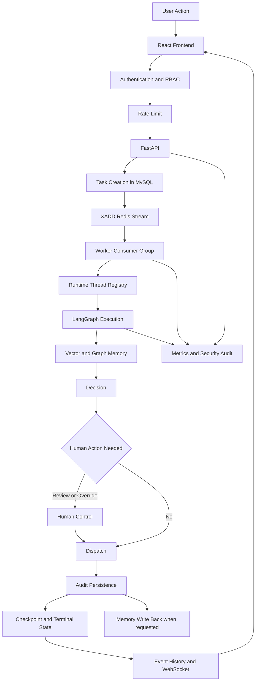

这条链路有三条贯穿始终的控制线：

- 身份线：Principal、Permission、Rate Limit、Security Audit。
- 状态线：Task、Runtime Thread、Checkpoint、Dispatch、Audit。
- 可靠性线：Idempotency、Lock、Optimistic Lock、Retry、Reconciliation。

## 2. 用户与前端入口

用户先进入角色默认工作区。当前实际角色为 EMPLOYEE、DISPATCHER、SUPERVISOR、OPERATOR、AUDITOR、ADMIN。前端不会只靠隐藏按钮实现安全；它用权限控制 UX，而后端再次执行强制授权。

典型入口：

- EMPLOYEE 从 My Tasks 查看本人配送任务。
- DISPATCHER 从 Workspace 或 Dispatch 创建并跟踪调度任务。
- SUPERVISOR 从 Reviews 处理人工复核，并在 Runtime 稳定边界执行 override。
- OPERATOR 从 Operations/Monitor 查看 Worker、依赖和运行时健康度。
- AUDITOR 从 Audit 查看安全事件与可用审计 read model。
- ADMIN 从 Overview 和各业务模块进行全局查看与管理。

前端 API mode 失败时不会自动回退 mock。这样可防止顶部显示演示 KPI，而下方真实列表为 0 的数据自相矛盾。

## 3. 安全请求流程

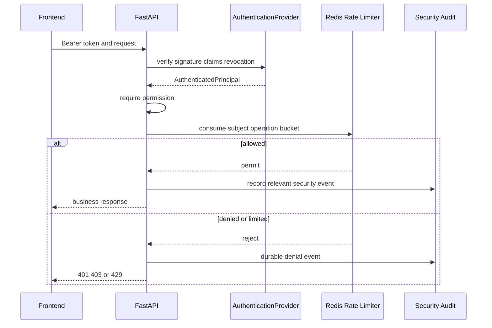

Development 使用 HS256 JWT，secret 最短 32 字符；production boundary 只允许 RS256/ES256 OIDC token，并通过 JWKS resolver 验证。issuer、audience、iat、nbf、exp、jti 都在边界内校验，Redis 保存 token revocation。

高风险写操作在 Redis rate-limit control plane 不可用时 fail closed。低风险读可进入受限的本地 emergency limiter，但不能借此绕过关键操作保护。

## 4. Task Creation

创建调度任务时，FastAPI handler 的职责严格收窄：

1. 验证 schema。
2. 验证 principal 与 `dispatch:create`。
3. 应用 submit 类 rate limit。
4. 生成或接受稳定 idempotency key。
5. 在 MySQL 创建/解析唯一 task。
6. 使用 `XADD` 发布到 Redis Stream。
7. 返回 HTTP 202 与 task id。

API 不同步执行 LangGraph。若两个请求使用同一 idempotency key，长期 ledger 确保它们解析到同一业务任务。

## 5. Redis Streams 与双 Worker

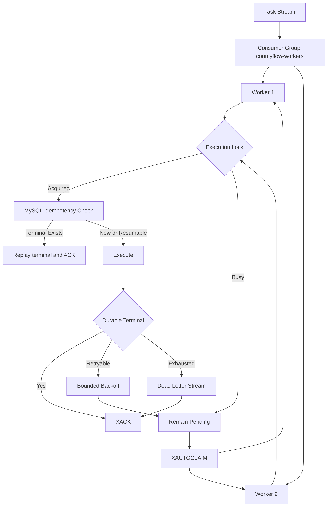

ACK 是可靠性边界：只有业务终态、Runtime Thread 与 Audit 已耐久化才 ACK。Worker 在处理中被取消，不会 ACK；消息留在 pending，超过 min idle 后被另一 Worker `XAUTOCLAIM`。

默认有界重试 3 次，指数退避约 1 秒起、最大 30 秒。耗尽后写 DLQ，再 ACK 原消息，避免毒消息无限阻塞 consumer group。

## 6. Runtime Thread 创建与恢复

每个 task 对应可持久化 Runtime Thread。MySQL registry 与 Redis checkpointer 分工如下：

| 存储 | 保存内容 | 作用 |
|---|---|---|
| MySQL `runtime_threads` | thread id、task id、status、state version、current checkpoint pointer、next node | canonical 执行位置与并发版本 |
| MySQL `runtime_thread_events` | append-only 节点推进/干预历史 | 审计与恢复证据 |
| Redis checkpointer | 完整 LangGraph checkpoint body | 图状态恢复 |

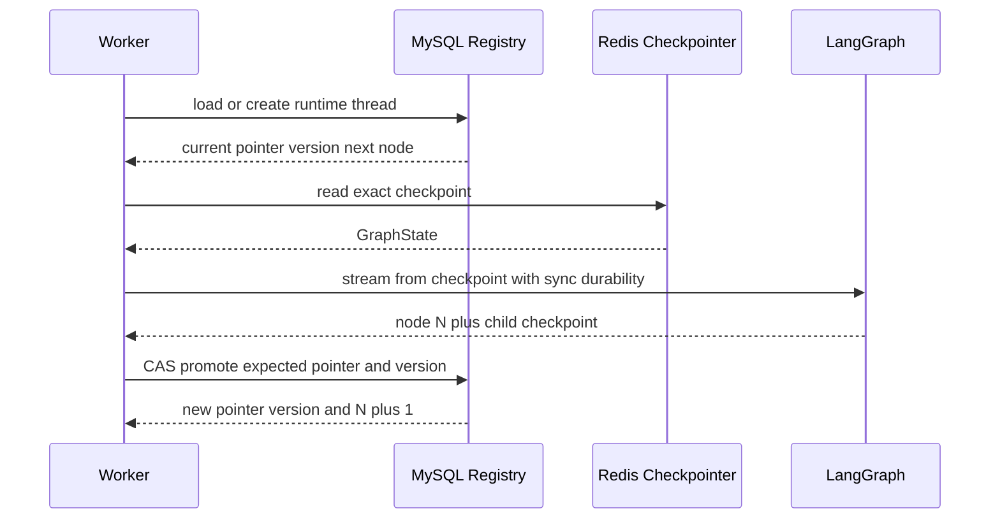

如果 Worker 在节点 N 结束并已生成 checkpoint 后崩溃，恢复逻辑读取 MySQL canonical pointer 与 Redis checkpoint，验证 ancestry 和 next node，从 N+1 执行，而不是重跑 N。若 checkpoint body 不存在或 pointer/ancestry 不一致，系统不会假装安全恢复，而是进入明确错误/对账路径。

## 7. 8-Agent 业务执行

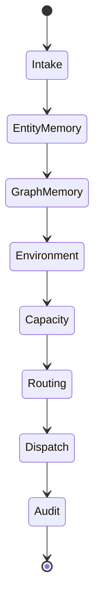

### 7.1 Intake

读取 task、order、anomaly、description，校验必填字段并规范化上下文。输出标准化 GraphState 和开始时间。输入缺失不会继续猜测，而是标记人工复核。

### 7.2 Entity Memory

将异常、司机、路线等文本组织为 query，通过 EmbeddingProvider 生成向量，在 Qdrant 查询 top 3 ACTIVE 且未过期记忆。失败时输出空集合和 `MEMORY_RECALL_ERROR`，允许业务继续。

### 7.3 Graph Memory

确定性 extractor 抽取实体与关系，Neo4j repository upsert 后执行 bounded related facts 与 multi-hop path 查询。跳数限制 1–3、默认 2，limit 25、timeout 1 秒。失败时安全降级，不阻塞主流程。

### 7.4 Environment

调用 async EnvironmentProvider，显式 timeout；连续失败打开 circuit breaker，使用静态路线 fallback，目标是在外部天气/道路服务故障时快速返回文档化降级结果。

### 7.5 Capacity

评估司机、车辆、route 与订单容量。车辆状态若为 BROKEN、UNAVAILABLE 或 MAINTENANCE，结果强制 unavailable。Provider 失败转换为业务层暂不可用与人工复核。

### 7.6 Routing

结合环境、Capacity、Qdrant 经验与 Neo4j 关系生成候选路线和推荐。记忆采纳受阈值与安全规则限制；无安全候选时进入人工复核。

### 7.7 Dispatch

创建或更新 dispatch。Dispatch row 使用 SQLAlchemy `version_id_col`；并发 stale write 转为冲突/人工处理，不用 Python equality 模拟 optimistic locking。

### 7.8 Audit

保存节点轨迹、输入摘要、记忆、环境、决策、人工标记、调度结果和错误。Audit persistence 失败时不能把 Stream 消息当作成功完成。

### 7.9 教师反馈对应的两类离线计算

新平县数字沙盘由仓库固定生成 8 个站点、18 个道路节点、26 条道路边、10 名司机、12 辆车辆和 12 张运单，不连接高德、实时路况、GPS 或真实车队。

车辆故障链路不是只把 `V-001` 标记为故障：Capacity 会扫描 12 辆车并逐项执行车辆/司机状态、驾照、剩余载重、冷链能力、接驳可达性与限重硬约束，再按 `FLEET_SCORE_V1` 排序。`DEMO-ORDER-001` 的固定结果是 `V-005`、司机 `D-003`、接驳边 `E20`、2.80 公里、6 分钟、总分 93.4；Dispatch 以乐观锁预留车辆并持久化两条计算证据。

道路堵塞链路会把 `E04` 纳入排除集合，并在同一份 18 节点、26 边的带版本道路快照上执行 `DIJKSTRA_V1`。`DEMO-ORDER-005` 的原路线 `E01→E02→E03→E04→E05` 为 10.00 公里、20 分钟；新路线 `E01→E06→E07→E08→E09` 为 13.20 公里、24 分钟，因此增加 3.20 公里和 4 分钟，且新路线不含 `E04`。

Result API 返回候选车辆、入选身份、接驳路线、原/新路线、算法、道路版本以及完整路网；前端用返回坐标绘制 SVG，并在刷新后重新读取持久证据。2026-09-08 的网络拦截 Playwright 回归 2/2 通过；真实公开 API + Redis Streams + Worker + MySQL/Redis 事后断言因当前工作区缺少 `.docker.env` 而 `BLOCKED BY ENVIRONMENT`，两类证据不得混称。

## 8. Memory 协同流程

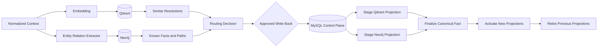

Vector Search 依据相似度给出“像什么”；Graph Search 依据已知边给出“与谁有关、经过什么路径”。Shared Memory 不参与开放检索，而是治理写回：Evidence、Mutation、Attempt、Decision、Version、Projection Status 与 Idempotency 都在 MySQL 控制面。

MERGE 保留并合并相容事实；REPLACE 创建新版本并退役旧投影；CONFLICT_REVIEW 不自动选择冲突事实；PARTIAL 表示跨存储仅完成部分步骤，由 reconciler 根据 mutation attempt 恢复，而不是让读取侧看到 staged 数据。

## 9. 人工复核

Routing、Capacity 或输入质量不足可把 task 标记为 manual review。Supervisor 在 Reviews 查看真实队列，提交 accept/reject 等当前支持的 review decision。决定被持久化并进入业务审计，前端随后刷新真实 task/read model。

人工复核与 Runtime Override 不同：复核决定“是否接受业务建议”；override 修改“图继续执行时读取的运行状态”。两者都需要权限与审计，但并发协议不同。

## 10. Runtime Override

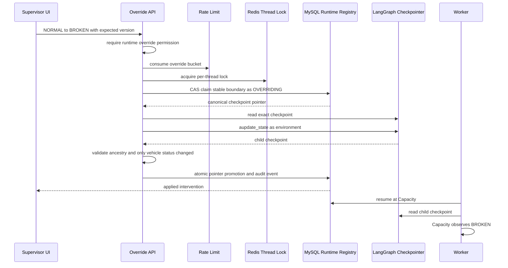

Override 只在 `environment → capacity` 边界合法，因为此时 Environment 已完成，Capacity 尚未读取车辆状态。若 Worker 已进入 Capacity，expected next node 或 state version 不匹配，请求以 stale/conflict 拒绝。

直接 UPDATE MySQL 无效且危险：下游读取 checkpoint，不读取那条旁路修改；同时会造成 checkpoint、registry、audit 三者分叉。`aupdate_state` 是使 GraphState 成为新 canonical execution state 的必要动作。

## 11. Worker 与 Override 竞争

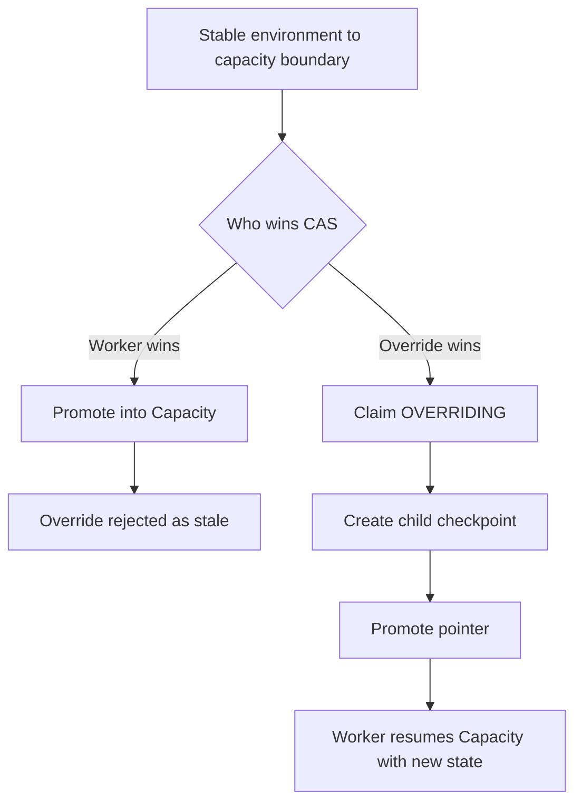

Redis lock 减少并行工作，MySQL CAS/state version 是最终冲突判定。即使 Redis lock 过期或发生竞态，数据库 optimistic/CAS 仍阻止两个 winner。Runtime Override attempt 与事件提供事后证据。

## 12. Dispatch、Audit 与终态

Dispatch Agent 完成业务写入后，Audit Agent 写耐久证据。Worker 随后更新 Runtime Thread/Idempotency terminal status，发布 task event，最后 ACK Stream message。

这一顺序保证：

- 看到 ACK 就意味着终态可从 MySQL 恢复。
- 重复 delivery 会命中 terminal ledger，而不是再创建 dispatch。
- Audit 失败不会被掩盖为成功。
- 前端状态查询与 WebSocket snapshot 来源一致。

## 13. WebSocket 进度链路

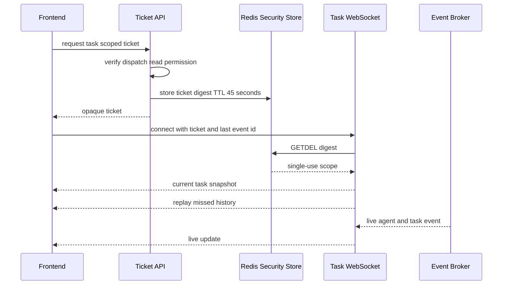

Ticket 只可使用一次、只允许指定 task scope、45 秒过期，Redis 只存 digest。scope 错误、过期/重放、缺失、安全控制不可用分别有明确关闭码。WebSocket 本身不接受“前端已登录”作为隐式授权。

## 14. Frontend 状态收敛

前端先消费初始 task snapshot，再按 last_event_id 重放遗漏事件，之后接收 live event。断线时可退回 status/result query，不需要用本地猜测覆盖服务端状态。

数据展示必须携带真值语义：LIVE 表示当前真实 API；DEMO 是明确种子数据；VERIFIED 是验收基线；STALE 是最后已知值；NOT_EXPOSED 是产品未开放；UNAVAILABLE 是依赖失败；NO_PERMISSION 是权限不足；EMPTY 是真实空结果。

## 15. Observability 流程

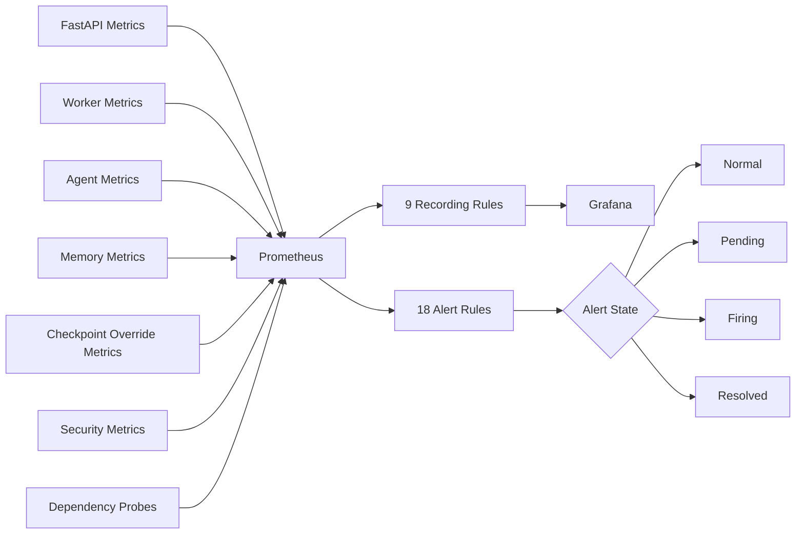

当前有 46 个 metric family definition、9 条 recording rule 与 18 条 alert rule。MetricsRecorder 由 API、Worker、Agent、Memory、Runtime、Security 和 Dependency probe 使用。标签保持稳定枚举，避免把 task id 等高基数字段放入 Prometheus label；关联 ID 更适合日志和审计。

## 16. Security Audit 与业务 Audit

业务 Audit 解释“系统为何做出这次调度”；Security Audit 解释“谁以什么身份尝试了什么受控操作、是否被允许”。两类证据目标不同，但都需要耐久化与脱敏。

Redactor 处理 Authorization scheme、JWT、带凭证 URL、query secret 和敏感 key。错误规范化不得回显 Provider authorization header、API key 或数据库密码。

## 17. Shared Memory 写回

并非每次调度都自动把输出当成事实。写回通过 Memory Mutation API/Service：

1. 验证 `memory:mutate` 与限流。
2. 记录 idempotency key、evidence 与 mutation。
3. 根据置信度、版本和现有事实选择 CREATE/MERGE/REPLACE/REJECT/CONFLICT_REVIEW/NOOP。
4. 获取 Redis fact lock。
5. 用 expected version 与 SQLAlchemy optimistic lock 更新 canonical control plane。
6. stage Qdrant/Neo4j projections。
7. finalize canonical fact。
8. activate 新投影、retire 旧投影。
9. 记录 attempt；失败进入 PARTIAL，后续 reconciliation。

读取侧只查询 ACTIVE 且未过期投影，因此 crash 后遗留 STAGED projection 不会污染 Agent recall。

## 18. 失败路径总览

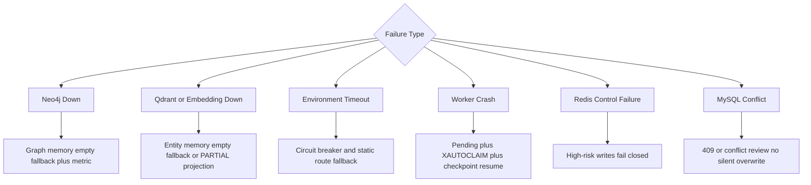

Prometheus 或 Grafana 不可用不会阻止核心业务；它们的故障会降低可观测性但保持故障隔离。MySQL 是 canonical truth，若 MySQL 不可用，关键写操作不能安全降级为 Redis-only 成功。

## 19. Disaster Recovery 边界

本仓库当前没有 V2-G3 实现。没有跨 MySQL、Redis、Qdrant、Neo4j 的 backup set、manifest、checksum、sanitizer、restore order、RPO/RTO 测量或 DR drill。因而本文不绘制虚假的 DR 恢复流程。

已有的 Worker recovery、Checkpoint recovery 和 PARTIAL reconciliation 属于运行时韧性，不等于灾备。灾备状态是 DEFERRED。

## 20. 完成链路的判定

一次任务只有满足以下条件，才能视为可靠完成：

1. task identity 与 idempotency 已持久化。
2. Runtime Thread current pointer 指向合法终态 checkpoint。
3. Dispatch 或人工复核结果已经写入 MySQL。
4. Audit evidence 已持久化。
5. task terminal state 可由状态 API 读取。
6. terminal event 已发布或可由 snapshot/history 补偿。
7. Stream message 已在上述步骤之后 ACK。
8. 没有 staged projection 被当作 ACTIVE 读取。

这使 CountyFlow 的结果不是一次不可重现的 Agent 输出，而是一条带身份、状态、版本、恢复点、操作人和证据的业务记录。
