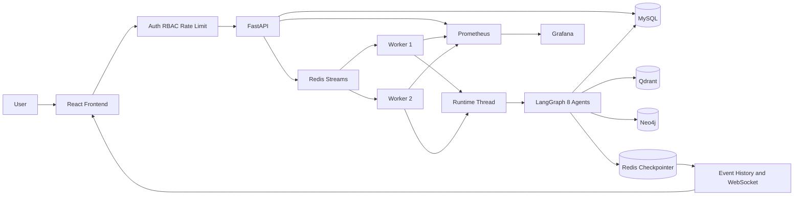
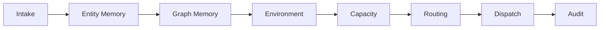
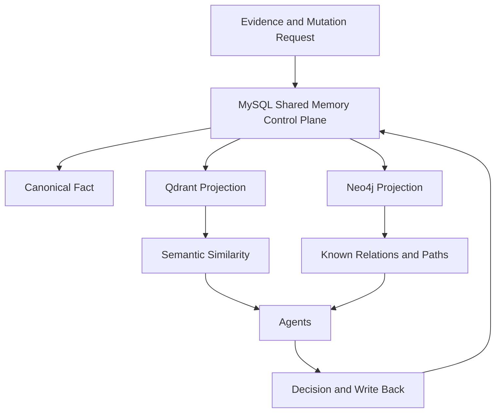
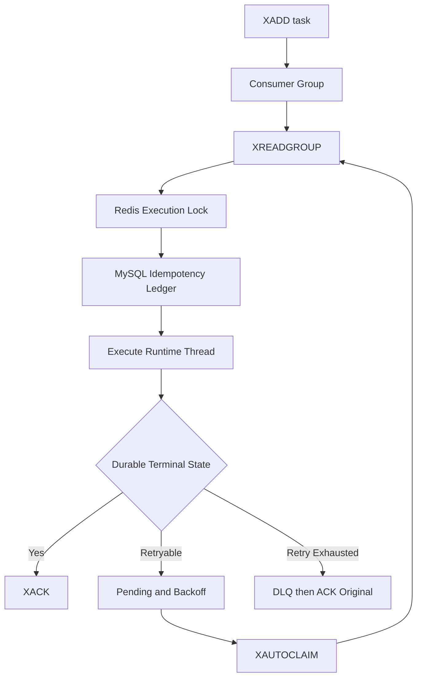

# CountyFlow 最终项目总览

> 事实基线：[FINAL_FACTS.md](./FINAL_FACTS.md)
> 审计日期：2026-08-31
> 状态：工程化智能调度原型已完成；生产 Provider wiring 与灾备未完成。

## 1. 一句话定位

CountyFlow 是面向县域物流异常处置的异步、可恢复、可人工干预、可审计的智能调度工程原型。

## 2. 项目解决的问题

县域物流场景具有路线长、信息碎、天气与道路波动大、车辆状态变化快、人工经验难沉淀等特点。CountyFlow 将订单、异常、司机、车辆、路线、环境与历史处置经验组织成可执行任务，通过 8-Agent LangGraph 分阶段形成调度决策，并用 Runtime Thread、Checkpoint、Runtime Override 和审计机制解决“执行中断、人工介入、并发竞争、结果追溯”问题。

项目价值不只是给出一条路线，而是把一次处置变成可恢复、可解释、可复核、可监控的工程流程。

## 3. 当前总体架构

核心生产形态设计是：

`Frontend → FastAPI → Redis Streams → Worker → LangGraph → Stores/Providers → WebSocket 或状态查询 → Frontend`

MySQL 是订单、任务、调度、审计和跨存储控制面的 canonical source of truth；Qdrant 与 Neo4j 分别承担向量检索与关系投影；Redis 同时承担 Streams、锁、短期安全控制和 LangGraph checkpoint storage，但不是长期业务真相。

## 4. 8-Agent 流程

| 顺序 | Agent | 中文职责 | 关键降级 |
|---:|---|---|---|
| 1 | Intake | 输入校验与规范化 | 缺失关键字段进入人工复核 |
| 2 | Entity Memory | Qdrant 相似经验召回 | Provider 失败时空召回并留错误证据 |
| 3 | Graph Memory | Neo4j 实体关系与多跳事实 | 图服务失败时安全降级 |
| 4 | Environment | 天气、道路与路线环境 | timeout + circuit breaker + 静态 fallback |
| 5 | Capacity | 司机、车辆、容量评估 | Provider 失败或车辆故障进入不可用/复核 |
| 6 | Routing | 候选路线与推荐 | 无安全路线时人工复核 |
| 7 | Dispatch | 持久化调度结果 | optimistic-lock 冲突，不静默覆盖 |
| 8 | Audit | 写入全链路证据 | 审计未耐久化则不安全 ACK |

当前图并未调用 LLM。仓库具备 `LLMProvider` 与 OpenAI-Compatible 实现，但没有注入 8-Agent graph；当前决策来自确定性服务、记忆与规则边界。这个事实避免把“具备 LLM 接口”误写为“已由大模型驱动生产决策”。

## 5. 三层 Memory 架构

- Vector Memory 回答“过去有没有语义上相似的处置经验”。
- Graph Memory 回答“实体之间存在什么已知关系、风险链路和多跳路径”。
- Shared Memory Control Plane 回答“哪条事实是 canonical、版本是什么、谁提交了什么证据、投影是否已完成”。

三者不能互相替代。向量相似度不能证明关系存在；图路径不擅长开放文本相似召回；两种投影都不能单独解决跨存储写入、冲突与版本治理。

Shared Memory 的准确生命周期是：mutation 进入 APPLYING，Qdrant/Neo4j projection 先 STAGED，mutation 进入 FINALIZING，随后 canonical fact 与新 projection 变 ACTIVE，旧 projection 变 RETIRED。失败可进入 PARTIAL 并由 reconciler 恢复。

## 6. Runtime Thread 与 Runtime Override

普通 LangGraph checkpoint 不能独立解决当前 checkpoint 的 canonical pointer、业务状态版本、人工介入 CAS 与跨存储审计。CountyFlow 因此增加 MySQL Runtime Registry：

- MySQL 保存 thread metadata、state version、current checkpoint pointer 与 append-only event。
- Redis `AsyncRedisSaver` 保存 checkpoint body。
- Worker 从最新稳定 checkpoint 的 N+1 节点恢复。
- 推进时校验 expected checkpoint、state version、next node 与 ancestry。

Runtime Override 只允许在 `environment → capacity` 稳定边界，把车辆从 `NORMAL` 改为 `BROKEN`、`UNAVAILABLE` 或 `MAINTENANCE`。它不是直接 UPDATE DB，而是获取 Redis thread lock、验证 expected version、MySQL CAS 认领、调用 `LangGraph aupdate_state` 生成 child checkpoint，再原子提升 pointer。这样下游 Capacity Agent、数据库与审计看到的是同一事实。

历史并发证据：合法覆盖 50/50，stale 阻断 20/20，并发 20 轮每轮唯一 winner，boundary race 50 轮违规 0，Capacity 读取 BROKEN 50/50，P95 181.643 ms。

## 7. Worker 可靠性

两个 Worker 共享 consumer group。系统依靠 Redis execution lock、MySQL idempotency ledger、SQLAlchemy optimistic locking、终态后 ACK、XAUTOCLAIM 与有界重试，实现 effectively-once business effect。它不宣称消息中间件层 exactly-once。

历史证据显示消息丢失 0、重复 dispatch/audit 0、DLQ 后 pending 0、同 idempotency key 唯一任务 1、Worker recovery 最大 4.824 秒。

## 8. Security

当前实际角色是 6 个：EMPLOYEE、DISPATCHER、SUPERVISOR、OPERATOR、AUDITOR、ADMIN。早期“五角色”表述指五个管理/专业角色；后续新增了一线 EMPLOYEE 与 My Tasks。

安全能力包括：

- Development JWT HS256 与 production OIDC/JWKS boundary。
- issuer、audience、iat、nbf、exp、jti 校验。
- Redis token revocation。
- RBAC permission matrix。
- Redis token-bucket rate limit；高风险写在 Redis 失效时 fail closed。
- durable security audit 与敏感数据 redaction。
- CSP、nosniff、Referrer-Policy、Permissions-Policy、CORS allowlist。
- WebSocket 45 秒、single-use、scope-bound ticket，Redis 只存 digest。

production profile 要求 OIDC/JWKS 与 HTTPS CORS，并拒绝开发/假 Provider。

## 9. Frontend 产品形态

当前最终 UI 是 White / Light Enterprise Theme：白色 Main、Sidebar、Topbar，teal accent，卡片、表格、图、监控与确认对话框保持一致视觉语言。早期 dark CSS 仍可在文件前部看到，但被后续完整规则覆盖；历史浏览器证据的 computed style 为白色。

真实页面/路由覆盖角色工作区、Admin Overview、My Tasks、Reviews、Runtime、Dispatch、Anomalies、Orders、Agents、Memory、Monitor 等。数据真值使用 LIVE、DEMO、VERIFIED、STALE、NOT_EXPOSED、UNAVAILABLE、NO_PERMISSION 与 EMPTY。

关键产品边界：

- API mode 不允许失败后静默回退 mock。
- `/team-tasks` 当前明确 NOT_EXPOSED。
- Runtime UI 读取线程元数据，不暴露 checkpoint body。
- Supervisor 全局 intervention history 未暴露。
- Auditor 全局业务/记忆/override 历史未暴露。
- Dispatcher 工作区级 AI 推荐聚合未暴露。

## 10. Observability 与 SLO

当前统计为 46 个 MetricDefinition family、9 条 recording rule、18 条 alert rule。指标覆盖 HTTP、Agent、Graph、Vector、Shared Memory、Checkpoint、Override、Worker、Redis、Dependency、Authentication、Authorization、Rate Limit 与 WS Ticket。

主要 SLO：

| SLO | 目标 |
|---|---|
| API latency | rolling 5 min P95 < 300 ms，至少 100 请求 |
| API server error | rolling 5 min 5xx < 0.1%，至少 100 请求 |
| Graph query | P95 < 150 ms，至少 20 查询 |
| Worker recovery | ≤ 5 s |
| Projection leak | 0 |
| Downstream stale read | 0 |

告警遵循 normal → pending → firing → resolved。历史故障注入验证 Neo4j 告警完成该生命周期；Neo4j、单 Worker、Prometheus、Grafana 均验证了相应降级或隔离。

## 11. Docker 拓扑

Compose 声明 11 个 service：mysql、neo4j、qdrant、redis、migration、worker-1、backend、prometheus、worker-2、frontend、grafana；其中长期运行 10 个，migration 是一次性任务。另有 6 个 named volume 和 default/host_access 两个 network。

本轮 `docker compose --env-file .docker.env config --services` 成功；Docker daemon 未运行，所以当前容器在线状态没有重新验证。历史证据为 10 个长期容器运行、migration exit 0。

当前 compose 是 `docker-dev`：fake embedding + in-memory capacity/routing。`runtime_profile=production` 会主动拒绝未完成的 production Provider wiring。

## 12. 测试与构建

| 门禁 | 本轮结果 |
|---|---|
| Ruff | PASS；两个历史 ACL 临时目录告警 |
| Backend pytest | 833 passed、7 skipped；使用进程级 auth disable 隔离本地 `.env` 漂移 |
| 默认 Backend pytest | FAIL：收集期 15 errors，dev JWT secret 长度不足 |
| Frontend Vitest | 49 files、228 tests passed |
| ESLint | PASS，0 error、2 warning |
| Frontend build | PASS，1915 modules transformed |
| Playwright | 14 specs；本轮未执行，历史关键套件通过 |
| Docker integration | 本轮未执行，Docker daemon 不可用 |
| DR E2E | 不存在 |

## 13. Final Verified Metrics

下表区分本轮执行与历史验收。历史数据没有被包装为 2026-08-31 在线数据。

| 指标 | 结果 | 口径 |
|---|---:|---|
| Vector Top-1 | 49/50，98% | 2026-08-27 real embedding evidence |
| Vector Top-3 | 50/50，100% | 同上 |
| Graph fact/path recall | 20/20、20/20 | 历史 real Neo4j evidence |
| Graph warm P95 | 10.354 ms | 50 样本历史证据 |
| 15-round black box | 15/15 | 历史综合验收 |
| Runtime legal override | 50/50 | 历史竞态验收 |
| Stale override blocked | 20/20；silent 0 | 历史竞态验收 |
| Shared Memory lost update | 0/20 | 历史并发验收 |
| Projection leak | Qdrant 0、Neo4j 0 | 历史故障恢复验收 |
| Worker recovery | max/P95 4.824 s | 5 次历史证据 |
| Message loss | 0 | 历史 Redis 可靠性验收 |
| V2-E Locust | min QPS 400.071；max P95 200 ms；error 0 | 3×60 s、50 users |
| Security ON | QPS 278.998；P95 270 ms；error 0 | 2026-08-29，50 users |
| Observability ON | QPS 1037.85；API P95 66.022 ms；error 0 | 2026-08-29 raw evidence |
| Observability ON graph workflow | P95 167.311 ms | 高于 150 ms SLO，不标 PASS |
| Backend tests | 833 passed、7 skipped | 本轮执行 |
| Frontend tests | 228 passed | 本轮执行 |
| Secret findings | 0 | 历史 838 files × 6 values scan，本轮未重扫 |
| Final pending | 0 | 历史 V2-E/Redis evidence |

## 14. 阶段演进

V1 建立异步系统；V2-A 增加 Graph Memory；V2-B 增加 Shared Memory；V2-C 建立 Runtime Thread/Checkpoint；V2-D1 实现 Runtime Override；V2-D2 交付 Intervention Workbench；V2-E 完成综合竞态与性能验收；V2-F 产品化前端；V2-G1 可观测性；V2-G2 安全强化；V2-F2 角色化白色 UI；随后补充真实 read models、员工任务、人工复核与调度发布。

V2-G3 没有生产代码、测试或验收证据，状态为 DEFERRED。

## 15. Top Technical Highlights

1. Runtime State Override：在运行中的图稳定边界上安全生成 child checkpoint，而不是旁路改库。
2. Persistent Runtime Thread：MySQL registry 与 Redis checkpointer 分工，支持 N+1 恢复。
3. Effectively-Once Worker：Streams、锁、幂等 ledger、终态 ACK、XAUTOCLAIM 与 DLQ 组合。
4. Graph + Vector + Shared Memory：语义、关系与 canonical governance 三层协作。
5. Projection Lifecycle：STAGED、FINALIZING、ACTIVE、RETIRED 与 PARTIAL reconciliation。
6. Cross-store Concurrency：Redis lock、SQLAlchemy version_id_col、checkpoint ancestry/CAS。
7. Security Boundary：OIDC/JWT、RBAC、限流、安全审计、脱敏和 single-use WS ticket。
8. Data Truth UI：真实、演示、过期、不可用、未暴露与无权限被显式区分。
9. Production-style Observability：46 metrics、9 recordings、18 alerts、SLO 与故障隔离。

## 16. 当前成熟度与剩余缺口

项目的工程原型完整度高，核心状态机、并发边界、恢复协议、安全控制和证据链已经闭环。它比普通 Agent Demo 更接近“可运营的业务系统”，但仍有明确生产差距：

1. production Capacity、Routing、Embedding wiring 未实现。
2. LLM 虽有抽象与实现，当前图未接入；是否启用需单独完成架构决策与验收。
3. V2-G3 灾备未实现，没有 backup/restore/manifest/checksum/RPO/RTO/drill。
4. 本轮未重跑真实依赖 integration、Playwright、故障注入和性能门禁。
5. 本地 `.env` dev JWT 配置漂移导致默认测试入口失败。
6. 部分角色全局视图和 Team Tasks 仍为 NOT_EXPOSED。
7. Worker/frontend readiness 与生产部署策略仍需增强。

最终判断：工程化智能调度原型已完成，生产化与灾备未完成。
