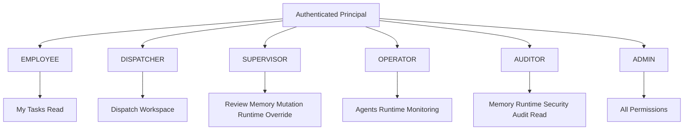

# CountyFlow 角色架构附图

> 本附图补充最终文档中的 Role Architecture。角色事实来自 [FINAL_FACTS.md](./FINAL_FACTS.md)。

早期“五角色体系”指五个专业/管理角色；当前代码在后续阶段增加 EMPLOYEE，因此真实总数为 6。Frontend permission UX 只负责可见性与可操作性提示，后端 permission dependency 才是最终授权边界。
