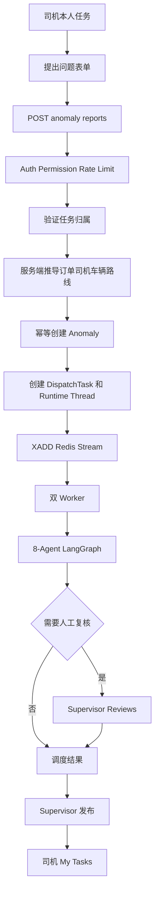

# CountyFlow 司机异常上报与自动 AI 调度设计

## 1. 文档状态

- 日期：2026-09-01
- 状态：设计已由用户确认
- 实施状态：尚未实施
- 适用系统：CountyFlow / 县域物流异常识别与智能调度系统
- 事实依据：当前 `EMPLOYEE`、My Tasks、Anomaly、DispatchTask、Redis Streams、8-Agent LangGraph 与权限实现

## 2. 背景与问题

当前 `/dispatch` 页面由调度员进入，页面使用固定的 `coreRainDispatch` 案例提交“李师傅 · 新平路 · 雨天道路湿滑”任务。调度员只能选择接收员工，不能填写真实现场问题。该页面适合演示异步调度链路，但不符合真实业务责任：道路、车辆、天气或货物问题首先由执行配送任务的司机发现，问题内容应由司机上报；调度员应负责查看处理过程、人工复核和发布调度结果。

当前 `EMPLOYEE` 只有 `dispatch:read`，只能读取分配给自己的任务。现有 Dispatch API 需要 `dispatch:create`，并接受客户端提供的 driver、vehicle、route 和 assignee。直接把该权限开放给司机会违反最小权限原则，也允许客户端伪造不属于自己的业务上下文。

本设计增加受限的司机异常上报入口。司机针对本人任务提交结构化现场问题，服务端验证归属并推导业务上下文，随后自动创建现有 DispatchTask 并发布 Redis Stream。系统继续复用当前 Worker、Runtime Thread、8-Agent LangGraph、Review、Publication 和 My Tasks 链路。

## 3. 目标

1. 让司机从本人未结束任务中提出现场问题。
2. 让上报内容成为 Anomaly canonical record，而不是前端硬编码案例。
3. 上报成功后立即自动启动现有 AI 调度链路。
4. 高风险、信息不足或决策冲突继续进入人工复核。
5. 主管审核并发布后，司机从 My Tasks 获取最终路线。
6. 服务端保证任务归属、上下文推导、幂等、限流和安全审计。
7. 将调度员 `/dispatch` 页面从演示提交入口改为调度任务中心。

## 4. 非目标

- 不上传现场照片。
- 不自动获取 GPS。
- 不增加文件或对象存储。
- 不新增 Agent。
- 不修改现有 8-Agent 顺序。
- 不新增消息中间件。
- 不新增数据库产品。
- 不实现语音输入。
- 不实现离线缓存提交。
- 不允许司机指定其他司机、车辆、路线或接收员工。
- 不允许司机直接发布 AI 推荐路线。

## 5. 已选方案

新增专用的司机异常上报 API 与页面，而不是给 EMPLOYEE 开放现有 `dispatch:create`。

采用该方案的原因：

- 权限可以精确收敛为 `anomalies:report`。
- 司机只提供现场事实，不控制调度系统内部字段。
- 服务端可以从已分配任务推导 order、driver、vehicle 和 route。
- Anomaly 与 DispatchTask 能形成明确来源关系。
- 现有 Redis Streams、Worker、Runtime Thread 与 LangGraph 无需重构。
- 复杂度低于增加 Outbox 状态机，适合首版。

被拒绝的方案：

1. 直接让 EMPLOYEE 调用现有 Dispatch API：权限过大，客户端可伪造上下文。
2. 先保存草稿再由独立 Outbox 启动：一致性更强，但新增状态机和表超出首版范围。

## 6. 用户与角色职责

### 6.1 EMPLOYEE / 司机

- 查看只分配给自己的任务。
- 针对未结束任务提出问题。
- 填写问题类型、描述、地点、车辆状态和紧急程度。
- 查看自动调度进度。
- 查看“等待人工处理”状态。
- 只在主管发布后查看最终路线与行驶说明。
- 不能选择其他员工。
- 不能读取其他司机任务。
- 不能直接创建任意 DispatchTask。
- 不能审核或发布路线。

### 6.2 DISPATCHER / 调度员

- 查看司机上报的异常和自动创建的调度任务。
- 查看 Agent 进度和调度证据。
- 不再替司机提交固定案例。
- 不需要通过司机上报 API 冒充司机。

### 6.3 SUPERVISOR / 调度主管

- 处理 `REVIEW_REQUIRED` 任务。
- 在已有权限边界内执行 Runtime Override。
- 审核并发布最终路线。

### 6.4 ADMIN

- 保持全部权限。
- 可审计司机上报、任务和结果。

## 7. 权限设计

新增权限：

```text
anomalies:report
```

权限矩阵变化：

| 角色 | 新权限 |
|---|---|
| EMPLOYEE | `anomalies:report` |
| DISPATCHER | 不增加 |
| SUPERVISOR | 不通过继承增加司机上报权限 |
| OPERATOR | 不增加 |
| AUDITOR | 不增加 |
| ADMIN | 通过全部权限集合获得 |

`anomalies:report` 只允许提交本人任务的异常。前端权限门控用于 UX，后端 `require_permission` 与任务归属检查是最终安全边界。

## 8. 数据模型

复用现有 `anomalies` 表，不增加独立 DriverIssueReport 表。

新增字段：

| 字段 | 类型 | 约束 | 用途 |
|---|---|---|---|
| `reported_by_subject_id` | String(128) | nullable for legacy rows, indexed | 记录上报司机 principal subject |
| `source_task_id` | String(36) | nullable for legacy rows, indexed | 记录司机提出问题时的原任务 |
| `location_text` | String(255) | nullable for legacy rows | 司机填写的发生地点 |
| `reported_vehicle_status` | String(32) | nullable for legacy rows | 司机报告时的车辆状态 |
| `report_idempotency_key` | String(128) | nullable for legacy rows, unique | 防止重复异常和重复调度 |

现有字段继续使用：

- `order_id`：由 source task 推导。
- `anomaly_type`：问题类型代码。
- `severity`：司机选择的紧急程度。
- `description`：现场问题描述。
- `status`：新上报初始为 `OPEN`。
- `reported_at`：服务端生成。
- `anomaly_no`：服务端生成稳定业务编号。

Migration 必须兼容现有数据，因此新字段允许旧行为空；新 API 创建的行必须在应用层填充全部报告字段。

## 9. API 设计

### 9.1 Endpoint

```text
POST /api/v1/anomaly-reports
```

要求：

- 已认证 principal。
- `anomalies:report` permission。
- 复用 `DISPATCH_SUBMIT` operation class 限流。

### 9.2 Request

```json
{
  "source_task_id": "TASK-example",
  "anomaly_type": "VEHICLE_BREAKDOWN",
  "description": "车辆行驶时出现异响，无法继续安全行驶。",
  "location_text": "新平路南段物流站入口",
  "reported_vehicle_status": "BROKEN",
  "severity": "HIGH",
  "idempotency_key": "driver-report-uuid"
}
```

客户端不得提交：

- order_id
- driver_id
- vehicle_id
- route_id
- assignee_employee_id
- anomaly_id

### 9.3 Response

首次成功与相同内容重放均返回 HTTP 202：

```json
{
  "anomaly_id": 42,
  "anomaly_no": "ANOM-example",
  "task_id": "TASK-example-new",
  "status": "PENDING",
  "accepted": true,
  "duplicate": false,
  "message": "问题已上报，AI 调度已启动。"
}
```

重放时 `duplicate` 为 `true`，anomaly 和 task identity 保持不变。

## 10. 服务端归属与上下文推导

`AnomalyReportService` 按以下顺序处理：

1. 使用 `source_task_id` 查询现有 DispatchTask。
2. 不存在时返回 `SOURCE_TASK_NOT_FOUND`。
3. 校验 `source_task.assignee_subject_id == principal.subject_id`。
4. 不匹配时返回 `REPORT_SOURCE_FORBIDDEN`。
5. 按现有 `MY_TASK_STATUS_GROUPS` 校验 source task：`READY`、`WAITING`、`ACTIVE` 可上报，`ENDED` 不可上报；不得另建一套冲突的任务状态映射。
6. 根据 source task 获取 Order。
7. 从 Order 读取 `driver_id`、`vehicle_id`、`route_id`。
8. 任一关键上下文字段缺失时拒绝自动调度，并返回稳定错误。
9. 以 report idempotency key 查找现有 Anomaly。
10. 创建或重放 Anomaly。
11. 构建内部 `CreateDispatchTaskRequest`。
12. `order_id`、`anomaly_id`、driver、vehicle、route 全部来自服务端。
13. `assignee_subject_id` 固定为当前 principal subject。
14. 调用现有 `DispatchTaskApiService.submit`。
15. 由现有服务创建 Runtime Thread、发布 Redis Stream 并返回 task identity。

API router 只处理 schema、permission、rate limit、错误映射与 response；不得直接操作 Redis、SQLAlchemy 或 vendor SDK。

## 11. 问题类型与车辆状态

首版问题类型使用稳定代码：

- `ROAD_BLOCKED`
- `ROAD_HAZARD`
- `VEHICLE_BREAKDOWN`
- `WEATHER`
- `CARGO`
- `CAPACITY`
- `OTHER`

前端显示对应中文标签，不把中文显示文本作为 API code。

车辆状态只允许：

- `NORMAL`
- `BROKEN`
- `UNAVAILABLE`
- `MAINTENANCE`

紧急程度只允许：

- `LOW`
- `MEDIUM`
- `HIGH`

## 12. 幂等设计

司机打开上报页面时生成一次 UUID idempotency key。表单重试期间保持该 key，不在每次点击时重新生成。

幂等规则：

- 相同 key、相同 source task 和相同内容：返回已有 anomaly/task。
- 相同 key、不同 source task：`409 IDEMPOTENCY_CONFLICT`。
- 相同 key、内容不同：`409 IDEMPOTENCY_CONFLICT`。
- 并发相同 key：数据库唯一约束确保唯一 anomaly；服务层重读 winner。
- 自动创建的 DispatchTask 使用从 report key 派生的稳定 task idempotency key。

Anomaly 与 DispatchTask 之间必须能通过 `anomaly_id` 和 `source_task_id` 追踪来源。

## 13. Redis Queue 故障语义

现有 DispatchTask service 在持久化 task 和 Runtime Thread 后发布 Stream。队列连接失败时 task 进入 `SUBMISSION_FAILED`，再次以同一个 task idempotency key 提交会重新发布原任务。

司机上报流程沿用该机制：

1. Anomaly 已经持久化。
2. DispatchTask 与 Runtime Thread 已经持久化。
3. Redis publish 失败。
4. API 返回 HTTP 503 与 `REPORT_QUEUE_UNAVAILABLE`。
5. Response 提供可安全展示的 anomaly/task identity 和 retryable flag。
6. 前端显示“问题已保存，AI 调度暂未启动”。
7. 用户点击“重试启动”时使用同一 report key。
8. 服务重放现有 anomaly，并让 DispatchTask service 重新发布 `SUBMISSION_FAILED` task。
9. 不创建第二个 anomaly、task 或 Runtime Thread。

前端不得在 503 时显示成功，也不得回退 mock 数据。

## 14. 错误契约

| HTTP | Code | 含义 | 前端行为 |
|---:|---|---|---|
| 403 | `AUTHORIZATION_DENIED` | 缺少 report permission | 显示无权限，不展示表单 |
| 403 | `REPORT_SOURCE_FORBIDDEN` | source task 不属于当前司机 | 显示不可上报该任务 |
| 404 | `SOURCE_TASK_NOT_FOUND` | 原任务不存在 | 返回 My Tasks 并刷新 |
| 409 | `SOURCE_TASK_ENDED` | 原任务已结束 | 禁止提交，提示选择进行中任务 |
| 409 | `IDEMPOTENCY_CONFLICT` | key 被不同请求复用 | 保留输入并要求重新打开表单 |
| 422 | validation error | 枚举、长度或必填错误 | 定位到字段并保留输入 |
| 422 | `SOURCE_CONTEXT_INCOMPLETE` | 运单缺少司机/车辆/路线 | 不启动 AI，提示联系调度员 |
| 429 | rate limit | 上报频率过高 | 显示稍后重试 |
| 503 | `REPORT_QUEUE_UNAVAILABLE` | 问题已保存但队列未启动 | 显示重试启动，不重建记录 |

所有 Provider、数据库、队列和内部错误必须经过现有 redaction。不得在响应、日志或 Security Audit 中输出 Authorization header、JWT、API key 或数据库凭据。

## 15. 自动 AI 调度流程



8-Agent 顺序保持不变：

1. Intake
2. Entity Memory
3. Graph Memory
4. Environment
5. Capacity
6. Routing
7. Dispatch
8. Audit

## 16. 司机端页面

### 16.1 路由

```text
/report-issue?taskId=<source_task_id>
```

路由要求 `anomalies:report`。

### 16.2 入口

My Tasks 增加：

- 页面顶部“提出配送问题”。
- 未结束任务操作栏“报告问题”。

页面顶部入口在没有预选任务时先让司机选择本人未结束任务。行内入口直接预选对应 task。

`READY`、`WAITING`、`ACTIVE` 任务显示上报入口；`ENDED` 任务不显示可操作的上报按钮。前后端共用与 `MY_TASK_STATUS_GROUPS` 一致的状态语义。

### 16.3 页面结构

第一部分为只读任务上下文：

- 运单号
- 起点与终点
- 当前车辆
- 当前路线
- 当前任务状态

第二部分为现场问题表单：

- 问题类型
- 问题描述
- 发生地点
- 当前车辆状态
- 紧急程度

第三部分为提交说明：

- 提交后立即启动 AI 调度。
- 高风险、信息不足或冲突会转人工复核。
- 首版不上传照片、不读取 GPS。

### 16.4 成功反馈

提交成功后显示：

- “问题已上报，AI 正在生成调度方案”。
- anomaly number。
- new task id。
- “查看处理进度”。
- “返回我的任务”。

“查看处理进度”导航到 `/dispatch/<new_task_id>`。新任务 assignee 为当前司机，因此现有 task read access 可以允许读取。

### 16.5 处理中状态

司机看到的状态文案：

- `PENDING`：等待 AI 处理。
- `PROCESSING`：AI 正在分析问题。
- `REVIEW_REQUIRED`：等待调度主管处理。
- `APPROVED` / `COMPLETED`：处理完成。
- `SUBMISSION_FAILED`：问题已保存，等待重试启动。

在主管发布之前，司机不能看到内部推荐 route 和 decision reason；发布后通过现有 publication 数据显示路线与行驶说明。

## 17. 调度员端调整

现有 `/dispatch` 页面不再提交硬编码 `coreRainDispatch`。

页面标题修改为“异常调度任务”。

页面职责：

- 解释司机上报后系统会自动启动 AI。
- 使用现有 anomalies read model 展示最近异常。
- 展示异常关联的 `latest_task_id`。
- 支持进入 task detail 查看 Agent 进度。
- 提示需要人工处理的任务进入 Reviews。
- 审核后由 Supervisor 发布路线。

Navigation 中“智能调度”名称可以保留。

旧页面中的“七智能体协作”文案必须删除或改为真实的“8-Agent 协作”。

Mock 数据可继续作为明确标记的演示/测试 evidence，但 API mode 不得调用固定 `coreRainDispatch`。

## 18. Frontend Data Truth

- 成功 response 才显示上报成功。
- 503 显示“问题已保存，调度未启动”，不是完全成功。
- 403 显示 NO_PERMISSION/forbidden 状态。
- 404 显示任务不存在并刷新本人任务。
- 真实空任务列表显示 EMPTY。
- API 不可用显示 UNAVAILABLE。
- API mode 禁止 mock fallback。
- task/anomaly identity 必须来自服务端 response。

## 19. 安全审计与可观测性

新增或扩展安全审计事件以记录：

- 上报允许。
- 权限拒绝。
- source task 归属拒绝。
- rate limit 拒绝。
- idempotency conflict。
- queue unavailable。

Security Audit 记录 principal subject、permission、reason code、correlation id 与安全 resource identity，不记录完整问题描述或凭据。

业务 Audit 继续由现有 8-Agent Audit 节点记录调度决策证据。

首版复用现有 HTTP、rate-limit、queue、task 与 agent metrics，不新增高基数 task/user labels。若增加 report outcome metric，其 labels 只能使用稳定 outcome code。

## 20. 后端模块边界

建议新增：

- `backend/app/anomaly_reports/models.py`：应用层输入/输出模型。
- `backend/app/anomaly_reports/protocols.py`：窄 repository 接口。
- `backend/app/anomaly_reports/service.py`：归属、幂等、创建和任务提交编排。
- `backend/app/anomaly_reports/sqlalchemy_repository.py`：Anomaly/Task/Order 查询与持久化。
- `backend/app/api/v1/anomaly_report_schemas.py`：Pydantic schema。
- `backend/app/api/v1/anomaly_reports.py`：FastAPI router。
- 新 Alembic revision：Anomaly report provenance/idempotency columns。

现有 `DispatchTaskApiService` 不承担司机归属规则；它继续负责 DispatchTask idempotency、Runtime Thread 创建与 Stream publish。这样司机上报领域规则不会污染通用任务提交服务。

Agent 不得直接导入 SQLAlchemy、Redis、Qdrant、Neo4j 或 vendor SDK；本功能不改变该约束。

## 21. 前端模块边界

建议新增：

- `frontend/src/pages/report-issue-page.tsx`
- `frontend/src/features/anomaly-report/`
- `frontend/src/services/api/anomaly-report-client.ts`
- `frontend/src/types/anomaly-report.ts`
- 对应 hook 或 feature submission controller

建议修改：

- `frontend/src/app/router.tsx`
- `frontend/src/navigation/navigation-registry.ts`
- `frontend/src/pages/my-tasks-page.tsx`
- `frontend/src/pages/dispatch-start-page.tsx`，可重命名为任务中心页面
- `frontend/src/auth/permissions.ts`
- 必要的 light-theme styles

表单状态、API client 和 page rendering 分离，避免把网络、校验与大段 JSX 集中到一个组件。

## 22. TDD 与测试设计

### 22.1 后端行为测试先行

先写并运行失败测试：

1. EMPLOYEE 对本人未结束任务上报，创建唯一 Anomaly 和 DispatchTask。
2. task assignee 为当前 principal。
3. order/driver/vehicle/route 从服务端推导。
4. 请求不能覆盖推导字段。
5. 他人 source task 返回 403。
6. source task 不存在返回 404。
7. 已结束 source task 返回 409。
8. 上下文缺失返回 422 且不发布 Stream。
9. 相同 key 重放返回相同 anomaly/task。
10. 相同 key 不同内容返回 409。
11. 并发相同 key 只创建一条 Anomaly。
12. Queue 失败后 task 为 `SUBMISSION_FAILED`。
13. 使用相同 key 重试会发布原 task。
14. EMPLOYEE 拥有 `anomalies:report`，没有 `dispatch:create`。
15. DISPATCHER 不能使用司机上报 endpoint。
16. Rate Limit 与 Security Audit reason code 正确。

### 22.2 Migration 测试

- upgrade 创建全部字段和唯一索引。
- 现有 legacy anomaly 可以保持新字段为空。
- 新应用写入满足长度和唯一约束。
- downgrade 只移除本 revision 资源。

### 22.3 Frontend 测试先行

1. EMPLOYEE My Tasks 显示“提出问题”。
2. 非 EMPLOYEE 不显示司机入口。
3. 已结束任务不显示“报告问题”。
4. 行内入口带入正确 task id。
5. task context 只读。
6. 必填、长度和 enum 校验正确。
7. 提交期间防止重复点击。
8. 成功后显示真实 anomaly/task identity。
9. 202 duplicate 按成功重放处理。
10. 503 显示“已保存、待重试”。
11. 重试复用原 idempotency key。
12. 403/404/409/422/429 使用明确状态文案。
13. `/dispatch` 不再调用固定案例提交。
14. API mode 不回退 mock。

### 22.4 Browser E2E

完整路径：

```text
EMPLOYEE 登录
→ My Tasks 选择本人任务
→ 提出问题
→ 提交结构化异常
→ 获得新 task id
→ 查看 AI 进度
→ Supervisor 处理 Review
→ Supervisor 发布路线
→ EMPLOYEE My Tasks 查看发布结果
```

额外 E2E：

- 另一个 EMPLOYEE 无法上报或读取该任务。
- 390px 窄屏表单无横向溢出。
- 键盘可完成所有表单操作。
- 503 不显示假成功。

## 23. 验证命令

实施完成后按项目规则运行：

```text
ruff check backend
pytest <targeted anomaly report tests>
pytest
npm run lint
npm run test
npm run build
npx playwright test <driver report specs>
git -c safe.directory=<workspace> diff --check
```

真实 Redis/MySQL 集成测试必须在 Docker 依赖可用时执行；无法执行时只能标为未重新验证。

## 24. 验收标准

功能验收必须同时满足：

1. 司机只能从本人未结束任务提出问题。
2. 司机不能控制服务端 driver/vehicle/route/assignee。
3. Anomaly 唯一持久化。
4. DispatchTask 自动创建。
5. Redis Stream 自动发布。
6. 现有 8-Agent 开始处理。
7. 司机能查看本人新任务进度。
8. 高风险任务能进入 Reviews。
9. 未发布路线对司机不可见。
10. 主管发布后司机能看到路线和说明。
11. 重复提交不创建重复 anomaly/task。
12. Queue 失败可用同一 key 恢复。
13. API mode 无 mock fallback。
14. Backend 与 Frontend 目标测试、lint、build 通过。
15. 不引入照片、GPS、文件存储、新 Agent 或新基础设施。

## 25. 实施顺序

1. Permission 与后端失败测试。
2. Anomaly migration/model。
3. Repository Protocol 与 SQLAlchemy adapter。
4. AnomalyReportService。
5. API schema/router/wiring。
6. Backend targeted tests。
7. Frontend types/client/submission tests。
8. Driver report page。
9. My Tasks entry。
10. Dispatcher task-center replacement。
11. Frontend unit/lint/build。
12. Docker integration 与 Playwright。
13. 全量测试和 diff checks。

## 26. 最终业务流程

```text
司机执行本人配送任务
→ 发现道路、车辆、天气、货物或运力问题
→ 在 My Tasks 点击“报告问题”
→ 填写结构化现场信息
→ 服务端验证身份、权限与任务归属
→ 服务端推导订单、司机、车辆与路线
→ 幂等创建 Anomaly
→ 自动创建 DispatchTask 和 Runtime Thread
→ XADD Redis Stream
→ 双 Worker 执行 8-Agent LangGraph
→ 自动完成或进入人工复核
→ Supervisor 审核并发布路线
→ 司机在 My Tasks 查看最终调度结果
```
